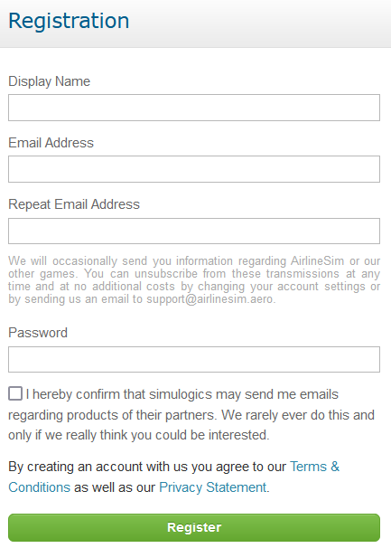

# 注册

在进入游戏之前，您需要通过点击[AirlineSim网站](https://www.airlinesim.aero/en/)上的登录按钮来创建一个账户。接下来，只需点击"立即注册"，然后选择一个显示名称（不能包含特殊字符或空格）、一个有效的电子邮件地址和您的账户密码。

{}
**信息**  
有时，向Hotmail或MSN邮箱发送注册邮件可能会出现问题。如果可能，请尝试使用其他电子邮件地址进行注册。如果您已经使用Hotmail或MSN邮箱注册了AirlineSim，请[联系客服](https://www.airlinesim.aero/blog/pages/support/)。
{}

也可以通过Facebook注册以游玩AirlineSIm。

接受条款和条件以及我们的隐私声明后，剩下的就是点击注册。很快，您将收到一封包含确认码的电子邮件。您需要输入该确认码才能完成注册。如果您没有收到确认邮件，请检查您的垃圾邮件文件夹。

成功登录后，您就可以开始了！请记住妥善保管您的登录和账户数据。如果您需要更改密码或电子邮件地址，请查看[账户设置]()。

{}
**重要提示**  
请注意，您只能创建一个账户。禁止注册多个账户。欲了解更多信息，请查看我们的游戏规则。
{}
