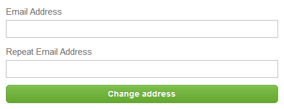

# 设置

要访问设置，请通过AirlineSim网站登录并选择"账户设置"。在这里，您可以调整账户的电子邮件地址、密码和通知。

## 更改电子邮件地址

要更改您的登录电子邮件地址，请在必填字段中输入您的新邮件地址，然后点击"更改地址"。由于我们需要一个有效的电子邮件地址，因此更改必须通过输入发送到您新邮箱的代码来确认。

## 更新密码

如果您想更改账户密码，只需选择"请求密码重置"，您将收到一封包含密码重置链接的电子邮件。

## 调整通知

在通知设置中，您可以选择希望接收我们发送的哪种类型的电子邮件通知。
