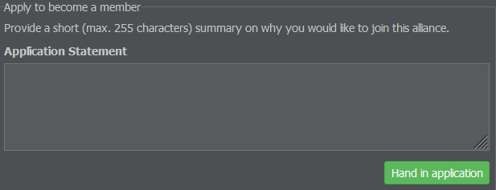

# 航空联盟

如果您正在寻找在游戏中与其他玩家建立连接的方式，您可以考虑加入一个航空联盟。您可能会问，那是什么？

航空联盟是多家公司之间正式的商业合作协议。它们为游戏增添了真实感，是与您的同伴玩家一起享受AirlineSim的绝佳方式。航空联盟的目标、成员资格标准和其他规程由其成员内部决定。

一些航空联盟通过联运和同时飞往同一机场来"创建"额外的枢纽。另一些联盟则通过购买股票来帮助其成员（如果它们已上市），运营自己的"咨询台"为新成员提供建议或者制定某些规则。

如你所见，可能性是无限的：从友好的聊天到完全实现的联运协议——一个好的航空联盟可以包括但不限于这些！

## 我该如何加入？

如果你想加入一个航空联盟，你有几个选择：你可以作为创始成员创建一个联盟，被邀请或申请加入。请注意：一家公司同时只能是一个联盟的成员。如果你已经是某个航空联盟的成员，你必须先离开才能申请加入另一个联盟。

### 创建联盟

要创建一个新的航空联盟，需要三名创始成员——您自己和另外两名。在"商业"选项卡的"新联盟"菜单中，输入您的航空联盟名称、总部，以及第二和第三创始成员的名称。

第一位创始成员是建立航空联盟的人。另外两位将收到通知，可以同意或拒绝请求。一旦所有创始成员都同意，航空联盟就成立了。

### 申请成员资格

如果您打算加入一个现有航空联盟，请查看其信息页面（您可以在"数据库"选项卡中访问可用联盟列表）。在这里，您会找到一份成员申请表（如果您已经是联盟成员，则不可见）。

您在此处输入的信息有助于联盟成员决定您的申请结果。您还可以询问他们的航空联盟做些什么、他们喜欢什么或者成员之间如何互相帮助。这样，您就知道如果加入会发生什么。

提交申请后，所有当前成员将收到有关申请的消息，并且必须进行投票。如果大多数人批准，您就正式成为成员了！

## 管理航空联盟

一旦您成为航空联盟的一员，您就可以作为成员、经理或董事作出贡献。

成员仅限于参与有关吸纳新成员的讨论和决策。经理可以更改联盟的信息文本和徽标。总监可以访问专用的总监选项卡，并可以任命经理、委派职责、开除成员或辞职并提名继任者。

管理任务只能由经理或总监执行。他们可以通过添加公司简介以及大尺寸和小尺寸徽标来自定义联盟。小尺寸徽标最大尺寸为23 x 23像素，将显示在联盟所有成员航班的抵达和出发航班显示上。

## 联盟概览

您可以通过查看航空联盟的信息页面找到更多详细信息。

"概览"部分列出了所有联盟成员及其状态，以及其枢纽的地理位置显示。如果您是联盟成员，任何未决策的成员申请也将在此处显示。请记住，每个成员都有一次投票机会，联盟成员越多，需要投的票数就越多。

统计信息选项卡显示了所有联盟成员的综合统计信息摘要，例如收入、运输的乘客和货物。

航班时刻表显示了成员的综合航班计划。
