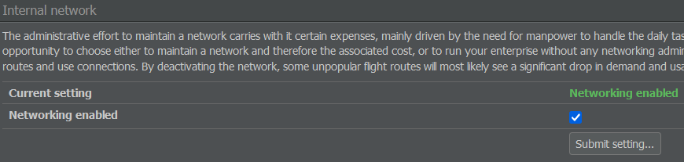

# 联运

与其他玩家建立联系的另一种方式是通过联运。这个概念指的是航空公司之间关于旅客中转的协议。具体来说，就是旅客能够在签订联运协议的航空公司运营的航班之间中转。

这在现实中是一项相当复杂的业务，但AirlineSim中使用了简化的模型。

## 如何开始

为了在由两家不同航空公运营的航班之间进行旅客中转，必须签订联运协议。这个协议目前涵盖了所涉航空公司的整个航线网络——对特定机场和航线没有限制。

要建立联运协议，您可以使用"商业"选项卡中的"联运"页面，或航空公司概览页面上的"发送联运请求"按钮。

一旦您收到对方航空公司接受的确认消息，两个航线网络将立即连接，旅客和货物可以在你们公司的航班之间进行中转。

{}
**信息**  
中转规则与您公司自己航班之间的中转规则相同，因此您仍应考虑机场的最短中转时间，并避免让旅客等待超过八小时（最长等待时间取决于服务器，因此在未来的游戏世界中可能会更长）。
{}

## 选择合作伙伴

当然，这些过程会涉及到一些成本。联运协议可能会让你售出更多机票，但也需要雇佣额外的网络规划人员（每家航空公司和每份协议至少需要一名员工，如果涉及大型航空公司，可能需要更多）。

因此，权衡额外客流量的价值与维持联运协议的价值是有必要的，特别是与一家非常大的航空公司签订协议时。

在接受联运协议之前，考虑您的联运合作伙伴的所在地、他们的航线是否适合您的网络以及他们的航班是否出现在[在线预订系统（ORS）]()上会很有帮助。理想情况下，您的合作伙伴会与您沟通，拥有良好的区域和国际网络，并且运营的航班在ORS上获得很高评价。

为什么这很重要？联程航班的评分总是低于直飞航班。如果您的合作伙伴（或您自己）的航班评分较低，那么联程航班甚至可能不会出现在ORS上。在这种情况下，乘客会更倾向于其他方式从A地飞往B地，再飞往C地。

{}
**示例**  
假设您在伊斯坦布尔，并且想在伦敦寻找一个联运合作伙伴。如果您和您的合作伙伴都只飞往欧洲主要首都城市，那么您将不会获得任何额外的乘客。

但是，如果您的合作伙伴运营国内和区域航班，那么您将会在飞往伦敦的航班上获得额外的乘客。这些乘客会转机前往阿伯丁或格拉斯哥。

反之，您也会获得乘坐您从安卡拉到伊斯坦布尔的国内航班，然后转机飞往伦敦的乘客。
{}

你的合作伙伴的地理位置不那么重要，但通常情况下，一个远离你的枢纽能提供许多不同的目的地。然而，你也可以与使用与你相同枢纽的公司签订合同。

## 取消协议

您可以随时取消联运协议。在这种情况下，协议将持续到取消请求所在的会计周结束。

## 内部中转

我们已经讨论了联运相关的成本，但是维护您自己航班之间的连接也不是免费的。他们与外部连接的处理方式相同，需要一定数量的员工来确保其顺利运行。

联运与中转页面提供了一个选项，可以通过勾选或取消勾选"启用网络"框来开启或关闭网络管理。

请记住，这将导致您的乘客无法在您的航班之间进行转机，并可能导致需求降低，尤其是在边缘航线上。
