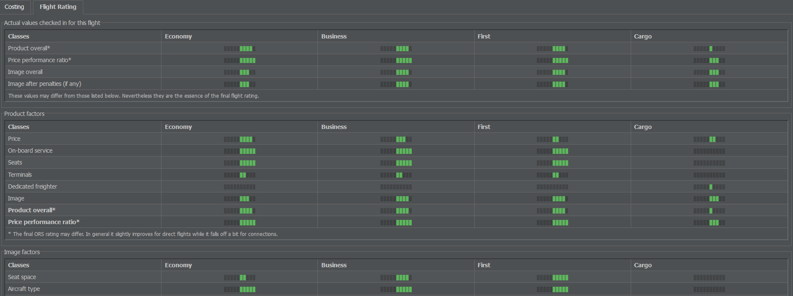

# 航班评分系统

航班评分系统（FRS）旨在为航空公司提供对单次航班的详细质量评估。其所提供的评分也用于计算航班对航空公司形象的影响。

可通过“商业”选项卡下的库存或航班号页面访问评估。只需点击航班旁的小白色箭头，就能看到该航班的信息页面。

评分位于“航班评分”选项卡中，由两个在运营上独立的组成部分构成：产品因素和形象因素。两者与该航班对航空公司形象的总体影响一并列出。

## 产品因素

产品因素描述了作为整体的航空公司形象。它们在乘客预订航班时产生影响，包含诸如价格、机上服务和座位质量等参数。

各个因素的权重因舱位等级（经济舱、商务舱、头等舱或货运）和航程距离而异：短程经济舱乘客在挑剔程度上会明显低于进行远程商务舱飞行的乘客。而且，由于每个舱位都有其自身的形象价值，货运方面的良好声誉不一定对客运乘客有意义！

在“航班评分”标签页中，你将看到因素列表以及代表其相关评分的彩色条：绿色条表示良好或优秀的产品评分；红色条表示差或糟糕的产品评分。

## 形象因素

形象因素包含比产品因素更不易量化的方面。每次完成的航班都会影响你航空公司的形象——具体取决于航班的“软件”因素，如座位空间、机况和员工情绪等，这就使得在这些领域的投资（或缺乏投资）成为区分航空公司的重要因素。

形象是在时间中逐步形成的，基于乘客完成航班后的主观体验。这就是为什么决策具有长期影响：一家公司若在一夜之间从使用陈旧、令人不适的飞机转而使用舒适、现代的飞机，普通乘客对其的总体看法不会立即发生变化。

## 航班评分

总体航班评分来源于对上述两个因素的评估。该评分随后与航班票价相比较，得出一个称为价格表现比（PPR）的数值。这仅直接影响在两个被评估目的地之间飞行的乘客——一般来说，正的 PPR 会吸引至少一部分客流，而负的 PPR 则不会。

但请注意，航班任一端的换乘选项可能会使两段航班合并后的 PPR 得到改善，足以让乘客预订一段单独为负 PPR 的航段。在计算换乘时，会考虑诸如换乘所用时间和总飞行时间等因素。

## 地面换乘

地面换乘——即乘客通过汽车、巴士、火车等方式出行——几乎总是可用的，并被视为任何单个航班或换乘评估的基准值。它们默认具有中性 PPR；因此，PPR 低于地面交通的航班或换乘通常不会接收到任何乘客。
