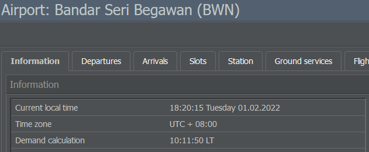

# 在线预订系统

作为游戏的核心功能之一，在线预订系统（ORS）每天生成大量旅行需求并在玩家的航班之间分配乘客。

航班在起飞前三天被加入到 ORS。比如你在周一早上启用了一条航班计划，而首班航班计划在 11 点起飞。在这种情况下，你必须等到 11 点你的首班航班才会出现在航班列表中。如果你延迟三天启用航班计划，它要到周四早上才会出现。

此后，随着时间推移新航班会被逐一添加到列表中，并且始终保持提前三天。
每个机场每天计算一次乘客需求（你可以在机场信息页的“需求计算”下找到具体时间）。在那时，你的航班将与其他可用航班进行比较，乘客会预订机票。

如果你立即激活你的航班时刻表，乘客只有一天的时间来预订你的第一班航班。如果你以三天延迟激活，你的航班将在连续三天内被检查，因此乘客有三天时间来购买机票。在普通航线上，你的航班会在这三天内逐步被填满。在非常繁忙的航线上，飞机很可能在一天后就被订满。如果需求很少，三天后你的飞机可能仍然半空。

当在线预订系统（ORS）检查你的航班时，它会在座位、机上服务、航站楼和航空公司形象与票价之间进行权衡。这个性价比决定了你航班的评分。评分高意味着乘客会优先选择你的航班。评分低则意味着他们会更愿意选择评分更高的竞争对手航班。

在 ORS 中，评分通过绿色条表示（将鼠标悬停其上可以显示确切数值），这使其成为跟踪航班表现的便利工具。
