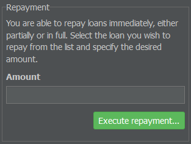
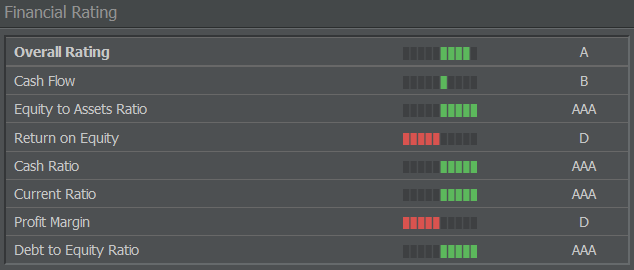
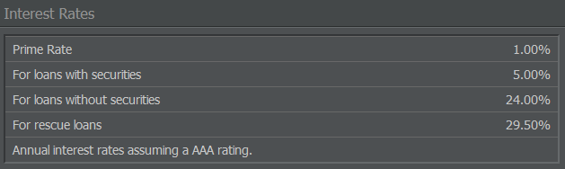

# 破产与贷款

## 无力支付

无力支付或资不抵债是指自然人或法人无法通过自身现金流支付账单，也就是说，常规收入不足以覆盖常规费用。在大多数情况下，信用额度也已用尽。这通常导致放弃公司并停止商业运营。

{}
**信息**  
在 AirlineSim 中，不能透支信用用于支付租赁分期或工资，因此贵公司的流动性由银行账户余额决定。
{}

如果你无法支付一架飞机的租赁费，你的企业在该时刻将被视为无法支付。在这种情况下，租赁合同会被立即终止，飞机被收回，保证金（扣除租赁费后）退还到你的银行账户。

如果你在周末结算时无法支付员工工资，后果更加严重，因为你的企业将被清算。

因此，如果没有精心运营，即便是一个健康的企业也可能陷入财务困境。只要企业有利润，就应准确计算并建立一些现金储备。制定时间表有助于监控固定成本（租赁费、地面服务）、贷款、工资和预计的股息支付。

## 公司清算

如果某企业在周末结算时因无法支付而被清算，或在此期间放弃企业，则将按以下方式解散：

* 飞机被归还给出租方（保证金退还，但扣除租赁费用）或被出售（以账面价值的 15%计价）。
* 员工被解雇（支付工资和赔偿）。
* 贷款被偿还（利息按比例计算）。
* 建筑物会被拆除（需支付费用）。

清算过程通过将剩余金额支付给上级企业来完成。

## 信贷系统

在 AirlineSim 中，贷款由 AS 银行管理和发放。你的信用状况，因此可获得的最高贷款额度以及相应的利率，会受到不同因素的影响：

* 贵企业的评级，
* 股本金额，
* 已签署贷款的金额
* 以及利润金额。

在签署贷款合约后的每七天间隔内，贷款本金和利息需要按期偿还。若您的银行账户余额允许立即结清贷款（另需支付一笔附加费用），您可以随时选择解约并提前偿还贷款。

游戏提供有担保和无担保两种贷款。

### 无担保贷款

无担保贷款可用于提高您的流动性。如果您在“新贷款”菜单中签署贷款合约（通过管理选项卡，选择公司财务部分的“负债”），您将获得一笔无担保贷款。这类贷款不与您计划的任何投资挂钩，因此利率相比有担保贷款会略高。无担保贷款的具体利率取决于当前的基准利率，但也可能根据您的信用状况而上调。

### 有抵押的贷款

有抵押的贷款仅在购买新飞机时提供，因此它们总是与特定的投资绑定，不会提高企业的流动性。因此，它们在某种程度上等同于融资购买。您投资的具体对象将作为贷款的担保物，在企业发生流动性不足时其所有权会被转入 AS 银行。基于此，AS 银行愿意提供比无担保贷款更高的贷款额度和更低的利率。

## 评级

在 AirlineSim 中，评级在财务方面起着重要作用。您的信用状况由评级等级表示，AAA 为最佳评级，D 为最差：

AAA - AA - A - BBB - BB - B - CCC - CC - C - CI - D

你可以在公司概览页面/仪表板上查看你航空公司的评分。

### 评级的影响

游戏会评估每家企业的信用状况。产生的评级会被公布（对所有用户可见），并在每次可能影响您信用状况的交易后更新。

您的评级（即信用状况）会影响游戏中的三个重要方面。

* **从 AirlineSim 融资购买**：如果你想从一家 AS 企业租赁飞机或购买由 AS 银行提供融资的飞机，你的评级必须至少为 B 或更好。有时，即便是 BB 评级也不足够。然而，如果飞机是从另一家出租方（即另一位用户）租赁的，你的评级就无关紧要，因此即使是 CCC 评级你也可以租赁飞机。

* **利息与贷款**：你的评级越低，可获得的最高贷款金额越少，利率相对于基准利率的差距越大。大多数情况下，当你的评级为 CCC 或更低时，AS 银行不会提供任何新贷款。根据债务与权益比率的不同，通常即便是 B 评级也不会被提供新贷款。

* [**首次公开募股（IPO）**]()：如果您的评级为 BBB 或更低，则无法进行 IPO。请记住，潜在投资者会查看您的评级，因此最低评级为 A 或勉强比 A 好的 IPO 可能会让他们望而却步。您的评级越高，给人的印象就越好。

### 参与评估的参数

评级由被评估企业的若干财务参数计算得出，例如权益与负债比率（你的贷款）和预测现金流。确切公式为机密，但以下为部分被评估因素的概述。

* **现金流**：描述在固定期间内的净增益。在 AirlineSim 中，这被简化为利润表中的利润减去核销（可通过管理选项卡，选择会计并导航到资产负债表来查找该报表）。

* **现金储备**：这是你银行账户上可自由支配的资本金额。

* **权益与固定资产比率**：指的是您的资产（即飞机设备账目、保证金和可选建筑）与净权益之间的比率。理论上有三种比率，但游戏使用第一种。其计算方式如下：权益与固定资产比率 = 权益 / 资产 × 100。

* **股本比率**：表示企业中自有现金（包括股东资金）的占比。贷款被视为债务资本。例如：如果一家公司资产负债表显示总资产为 1 亿 AS$，贷款为 3550 万 AS$，则其股本比率为 64.5%。

* **股本回报率（ROE）**：该数值指在特定时间内已使用资本的收益率，描述航空公司从可用净股本中获得了多少收益。其计算公式如下：股本回报率 = 利润 / 净股本 × 100。

* **现金比率**：该参数描述短期偿付财务义务的能力，计算公式如下：现金比率 = 流动资产（银行账户上的现金） / 短期负债（所有常规支付，如工资、租赁费等）。

* **流动比率**：与现金比率相同，但在此情况下，流动资产（流动资金加上保证金）也被视为流动资产。

* **利润率**：这是你收益中利润所占的百分比（在 AirlineSim 中以每周计算）。其计算公式如下：利润率 = 利润 / 收入 × 100

* **负债率**：负债率是贷款占你总资产的比例，所以它在某种程度上是利润率的相对面。其计算公式如下：负债率 = 贷款 / 股东权益 × 100

## 基准利率

在现实中，负责的中央银行当局会在一定区间内定义基准利率。在 AirlineSim 中，基准利率并非一成不变。它们会根据游戏世界的当前发展进行调整，且可能一天内多次变动。因此，与现实相比，利率可能出现更大且更频繁的涨跌。

在每个游戏世界的首页，会显示两个基准利率：一个适用于无担保贷款，另一个适用于有担保贷款。请记住，这里列出的基准利率要求你的评级为 AAA——如果你的评级较低，AS 银行可能会要求更高的利率。
