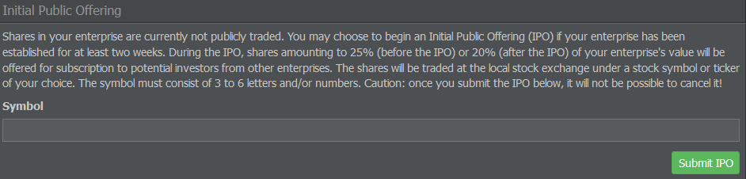

# 首次公开募股

在一些游戏世界中，玩家可以进行 IPO，英文全称为 Initial Public Offering（首次公开募股）。在成立企业至少两周后，你可以申请在 AirlineSim 股票市场挂牌并开始公开交易股份。

## 基本规则

在开始之前，这里有一些关于 IPO 和股票市场交易的一般规则和提示，这些规则主要用于保护新上市公司并避免非法行为：

* 首次公开募股（IPO）的认购上限为所发行股份的 200%。
* 单个企业在一次 IPO 中最多可认购所发行股份的 33%。
* 每个参与认购 IPO 的企业必须证明其股本/股本资金有显著增加。初始启动资本不计入此项。
* 股票价格遵循一个既定的基准利率，与公司价值紧密相关，并对公司未来发展提供大致预测。
* 股票通过交易的价格变动将仅限于基准价格的正负 10%。

## 提交首次公开募股

在进行 IPO 时，将向其他企业的潜在投资者提供相当于您企业价值 25%（IPO 之前）或 20%（IPO 之后）的股份认购。这些股份将在当地证券交易所以您选择的股票代码进行交易。

如果您准备好上市，请在管理选项卡中前往企业融资页面，选择由 3 到 6 个字母和/或数字组成的股票代码。然后按下绿色按钮提交您的请求。请注意，IPO 提交后无法取消，请谨慎操作。

## 红利分配

在提交首次公开募股（IPO）后，你必须将每周利润的 15%支付给股东。由于大多数股份属于你（默认情况下你拥有 80%，除非在 IPO 后你另行出售了部分股份），大部分这些股息会回流到你自己的持股或母公司的口袋。

## 投资

你也可以投资其他玩家企业的 IPO。在这种情况下，会有一些适用规则。

### 一般规则

如果股票认购未达到 50%（即认购的股票少于所供股票的 50%），首次公开募股将不会成功，您将获得退款。

在 50%到 100%之间，您将按比例获得公司股份。例如，如果您认购了所供股票的 25%，您将获得企业 5%的股权（100% * 20% 可供股份 * 25% 认购 = 5%），每股价值正好为 100 AS$。

高于100%，最多200%时，您按所投资的全额获得股票，只是所获股票数量更少且价格更高。

如果报价超过 200%，你将以 200 AS$的价格获得你所投资份额的全部回报，但仅限于 200%对应的成交量。

### 示例

下面是当报价超过 200%时会发生情况的一个示例。

如果基本股本为 1000 万 AS$（除以 100 = 100,000 AS$ 的每股面值），在 100%时你的目标市值将为 1250 万 AS$（+25%）。因此需签署的指定价值为 250 万 AS$（1250 万 - 1000 万 AS$），上限为 200%，这意味着你最多可以认购价值 500 万 AS$。

发起首次公开募股的企业将始终保留 80%的股份，因此始终会有 20%需要分配。


 **100% 已认购，全部由你认购** ：

如果我们继续上述例子，在这种情形下你将以每股 100 AS$的价格收到 25,000 股。进行首次公开募股的企业将获得 250 万 AS$，因此你拥有该企业的 20%股份。企业新的整体账面价值将为 1250 万 AS$。



 **200% 已由你和另一家公司（B）签署** ：

在这种情况下，你以每股 200 AS$获得 12,500 股。B 也同样获得 12,500 股。进行首次公开募股的企业收到 500 万 AS$，你在该企业中拥有 10%的股份。该企业的新总体账面价值将是 1,500 万 AS$。



 **250% 已由你和另外两家公司签署（你签署 100%，B 100%，C 50%）** ：

你获得 10,000 股（25,000 除以 100% + 100% + 50%）以每股 200 AS$计，并相应支付 200 万 AS$。差额（50 万 AS$）将退回到你的银行账户。

B 情况相同，而 C 获得 5,000 股，每股 200 AS$支付 100 万 AS$，并获得 25 万 AS$的退款。你在新企业中的份额将是 8%。B 也拥有 8%，而 C 的份额为 4%。该企业的新总体账面价值将是 1,500 万 AS$。


## 减值与公司价值

基本上，公司价值除以股票数量等于基础股价。规则规定该基础价格最多可有 10%的偏差。

对于上述三种情形，可以总结如下：

* A：当公司价值为 1250 万 AS$且有 125,000 股时，基础价格为 100 AS$，最高为 110 AS$。
* B 和 C：在公司价值为 1,500 万 AS$ 且有 125,000 股的情况下，基础价格为 120 AS$，最高价格为 132 AS$。

股票价格每天都会重新计算/调整，紧密贴合实际账面价值。公司经营表现越好（就现金流而言），股价上涨越快。派发股息实际上是资产负债表的收缩，提取股本因此导致股票价格下跌。
