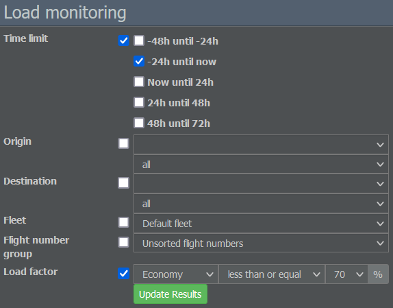

# 载客率

一架飞机若飞行时座位只有一半被占用就会亏损，所以务必尽量让你的飞机保持满载。如果你的有效载荷不足，就需要另一架飞机盈利来弥补损失。然而，这意味着你在两架飞机上都投入了资金，净结果仍然为零。

{}
**示例**  
假设你有一架 100 座的飞机，而盈亏平衡点大约在 70%。这意味着 70 名乘客能让你勉强维持，80 名乘客将带来约 10%的利润，90 名乘客将带来约 20%的利润，而满座则可带来约 30%的利润。
{}

每条航线和每种飞机都不同，但上述数字相当接近，因此瞄准高载客率非常重要。尽量将你的平均载客率保持在约 90%或更高。

你可以通过前往“商业”标签并选择“负载监测”来关注航空公司的表现。在这里，你可以按时间范围、航线、机队和航班号组检查载客情况。

如果你想提高载客率，可能会考虑出售更便宜的机票。不过，降价并不总是有效。在现实世界中，低价可以吸引原本不会乘机的新乘客。但在游戏中，乘客数量是固定的。

那么如果更便宜的机票也无法把你的飞机填满，你还有哪些选择？

* **检查航班时刻表**：你的飞机是否成潮汐式在枢纽进出？你是否考虑了最低换乘时间？良好的换乘航班通常会改善你的载客率。
* **优化你的服务**：你是否为航班分配了服务配置？如果没有机上服务，很少有乘客会登上你的飞机。
* **与联运伙伴对接**：如果目的地机场有联运伙伴，务必将你的航班与他们的航班衔接起来。

如果载客率仍然没有改善，尝试寻找更有利可图的航线。例外情况：你的飞机只坐了一半，但大多数乘客是中转乘客。在这种情况下，最好租用一架更小的飞机来执飞该航线。
