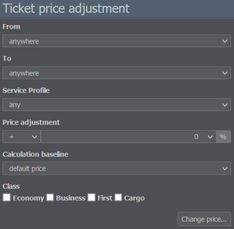

# 票价

## 乘客会付多少钱？

其实，答案相当简单：如果你是该地区唯一的航空公司，乘客会花大价钱登机。他们可能会因此恨你，但他们会付钱。然而，你很少是唯一可选的航空公司，所以这里有一些经验法则，帮助你在制定票价时做出决策。

如果你提供体面的座位和服务，可以尝试将票价定在默认价格上方约 25%。根据机型不同，这通常能带来大约 30%的利润率。

你也可以考虑把国内航班票价定得高一些，尤其是当你能与竞争对手保持交谈时。国际航线上的竞争通常过于复杂，难以通过协商定价策略来解决。在那种情况下，只能靠反复试验并花时间检查你的航线。

另一个建议是注意“隐形竞争”：你可能在从机场 A 到你枢纽的航线上有大量乘客，但突然他们的数量下降，尽管你没有看到任何竞争对手。

这种情况可能发生在一些乘客只是飞到你的枢纽以转机前往机场B时。如果另一家航空公司开始在机场 A 和 B 之间直飞，乘客会更倾向于直飞航班。或者另一家航空公司也通过他们的枢纽提供从 A 到 B 的联程，但价格更便宜。正如你所见，可能性很多，所以尽量留意市场动态。

## 有用的工具

如果你对票价仍有些不确定，总可以依靠游戏的工具来获得指引。

* “**市场分析**”页面会显示某条航线所有可预订航班的列表。它会告诉你竞争对手为一张票收取多少钱，以及他们的航班是否已满。

* 某国的“**机队清单**”（在“数据库”标签中可用）显示了关于竞争对手客舱配置的详细信息。每个舱等的座位数可在“配置”栏中查看，这可能让你了解他们使用的是哪种座椅。如果某位玩家使用的是标准座椅，他们就能承受降价；如果他们提供更昂贵的座椅，就可以出售更贵的机票，却仍然具有吸引力。

* [**在线预订系统**]()会告诉你哪些航班评分最高。显然，定价很重要，但旅程的总时间也会被考虑在内。较短的中转时间可以让你的航班对乘客更具吸引力。

## 分析竞争对手

如果你想了解竞争公司表现如何，可以查看它们的股票市场信息（如果它们已上市的话），并查看它们的每周营业额和利润率。

统计页面也可能是一个有用的信息来源：用一家航空公司上周运送的乘客数量除以它们提供的座位数，你就能得到它们的客座率。

如果你的竞争对手评级为 B、利润率为 5% 且平均客座率为 75%，试着降低你的票价直到你的航班全部订满。如果情况相反，你可能需要寻找一条更有利可图的航线。
