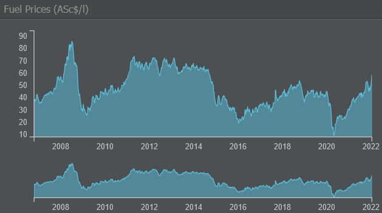

# 燃油消耗

燃油并不便宜。你为燃油支付的每一块钱都会减少利润，因此为合适的航线选择合适的飞机非常重要。

在游戏中，关于燃油消耗的两个主要因素是每次航班燃油和每公里燃油。

每次航班燃油（或每循环燃油）用于滑行、起飞、爬升到巡航高度和着陆。每公里燃油则覆盖机场之间的距离，只要该距离小于飞机的最小航程——飞得更远意味着需要携带（并消耗）更多燃油并运送更少的乘客。

{}
**示例**  
假设一架飞机每个航班周期需要 1000 升燃油且每公里消耗 5 升，而另一架飞机每个航班周期需要 2000 升燃油且每公里消耗 3 升。这样的话，如果航程少于 500 公里，第一架飞机的成本更低，但在更长的航线上第二架飞机更有利可图。如果使用飞机类型评估工具，务必检查多个目的地！
{}
