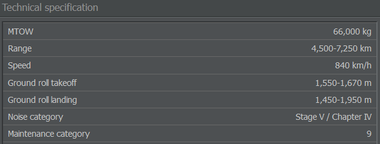

# 维护类别

在 AirlineSim 中，每种飞机型号都有一个独特的维护类别，描述其与相似型号一起维护的能力，例如将空中客车 A318 与 A319、A320 或 A321 一起维护。这涉及到由于飞机之间技术相似而在培训和设备方面的相似需求。你可以在飞机的资料页查看其所属的类别。

虽然 A320 与 A318 差别不大，但波音 737 则是完全不同的飞机，具有不同的要求。因此，维护类别实际上反映了在机队多样化时维护效率的损失，这就是为什么跟踪你的飞机所属多少个类别很重要。

你的前三个维护类别是“免费”的，意味着你只需支付 100% 基础维护费用。第四个类别会将维护成本提高 15%，第五个再增加 15% 达到 130%，以此类推。该数值适用于你的所有飞机。

已购买并出租的飞机不计入您的维护类别限制。
