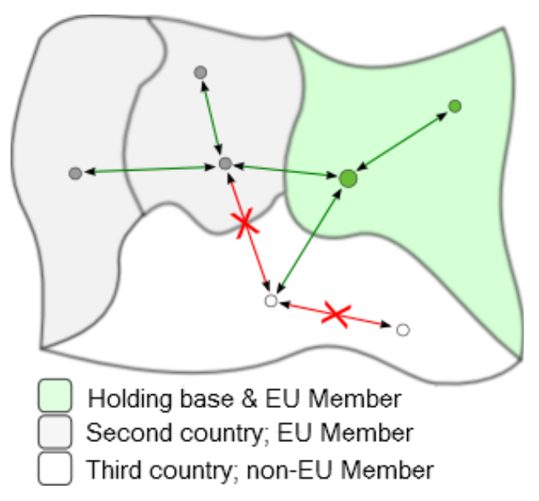
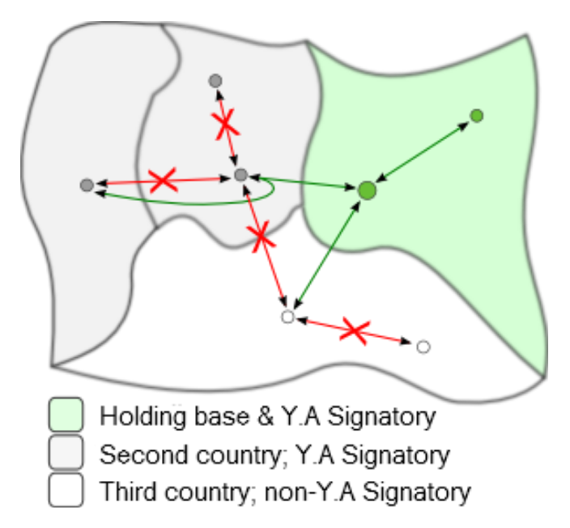

# 航权

游戏的一个关键方面是航空公司属于国家实体，而非全球实体。现实世界中，各国之间的航空运输协定规范着乘客运输，AirlineSim 也反映了这一点，尽管以稍微简化的方式表现。

## 什么是航权？

所谓航权是指决定你是否可以在两个目的地之间运送乘客的规则。你服务特定市场的权利由你控股公司（holding）总部所在地的国家决定。对于子公司，这些权利通常也基于控股公司的所在地（如果你的航空公司为上市企业，则可能基于所持股份的综合比例）。

{}
**示例**  
如果你的控股公司总部设在马尼拉，那么旗下子公司将继承其在菲律宾任何机场对之间执行国内航班的权利，但不被允许在中国境内执行国内航班。
{}

## 等一下——我完全可以添加中国航班！

即使你的控股公司设在菲律宾，也没有什么物理上的障碍阻止我们假想的航空公司在中国安排国内航班；例如，你可能希望飞机在返程时从另一个机场出发。然而，以这种方式安排的任何航班都不会收到乘客预订。

## 那么，我可以飞到哪里？

好问题——答案会根据你的控股公司所在地而有所不同。以下规则是通用的，适用于设在所有国家的控股公司：

* 任何航空公司都可以在其控股所在国家国内运输乘客（即在同一国家内的两点之间）。

* 任何航空公司都可以在国际上运输乘客，往返于其母国（其控股所在的国家）的任一地点与第二国的任一地点之间。

* 如果行程涉及在其控股所在国家的停留（至少包括一次起飞和一次降落），任何航空公司都可以在两个不同国家的任一地点之间进行国际运输。

除了这些普遍规则外，还有一些特殊情况：

* **欧盟**：任何总部设在欧盟的航空公司可按任意航线在欧盟内部任意两点之间运送乘客；换言之，欧盟的国内市场作为一个大型的、虚拟的国家来运作。重要提示：该规则不适用于始于或止于欧盟以外地区的航班——任何此类航班必须始于或止于航空公司控股所在国家。

* **澳大利亚与新西兰**：同样地，任何总部设在澳大利亚或新西兰的航空公司可在澳大利亚与新西兰范围内的任意两点之间运送乘客；但同样地，该规则不适用于始于或止于澳大利亚与新西兰以外地区的航班。

* **亚穆苏克罗决定**：任何总部设在《亚穆苏克罗决定》缔约国的航空公司仅当且仅当相关航班是自其控股国出发并使用游戏的经停（via）功能的延续航班时，方可在第二国与第三国之间运送乘客。

## 欧盟条约与大洋洲开放空域

## 雅穆苏克罗决议与加勒比共同体（CARICOM）第五航权

## 货运航班呢？

全球货运市场在完全自由化的基础上运作，反映出其性质相对更具挑战性。航空公司可以在世界任何两点之间运输货物，不论其控股方位于何处（除非存在政治限制）。

## 如果我的国内市场不再足够大怎么办？

世界上有若干国家允许外资投资；前述规则在这些国家同样适用，但与不允许外资的国家不同，外资控股可以通过在允许投资的国家设立企业，在该国经营航空公司，享受授予本国控股的所有权利。

{}
**信息**  
一个国家是否接受外国投资取决于游戏世界。你可以通过进入“数据库”选项卡，选择“国家”，并在该国家信息页面中查看“无限制市场准入”下的说明来确认。
{}

下面是游戏中使用的不同列表的概述。新游戏世界目前使用的是列表 C。

| 国家/地区 | 列表A | 列表B | 列表C |
| :-- | :-- | :-- | :-- |
| 安哥拉 | 包括 | 包括 | 包括 |
| 阿根廷 | 包括 | 包括 | 不包括 |
| 阿塞拜疆 | 包括 | 包括 | 包括 |
| 巴哈马 | 包括 | 包括 | 包括 |
| 巴巴多斯 | 包括 | 包括 | 包括 |
| 贝宁 | 包括 | 包括 | 包括 |
| 柬埔寨 | 包括 | 包括 | 包括 |
| 喀麦隆 | 包括 | 包括 | 包括 |
| 乍得 | 包括 | 包括 | 包括 |
| 哥伦比亚 | 包括 | 包括 | 不包括 |
| 哥斯达黎加 | 包括 | 包括 | 不包括 |
| 吉布提 | 包括 | 包括 | 包括 |
| 多米尼克 | 包括 | 包括 | 包括 |
| 多米尼加共和国 | 包括 | 包括 | 不包括 |
| 厄瓜多尔 | 包括 | 包括 | 不包括 |
| 冈比亚 | 包括 | 包括 | 包括 |
| 格鲁吉亚 | 包括 | 包括 | 包括 |
| 格林纳达 | 包括 | 包括 | 包括 |
| 危地马拉 | 包括 | 包括 | 包括 |
| 几内亚比绍 | 包括 | 包括 | 包括 |
| 洪都拉斯 | 包括 | 包括 | 包括 |
| 伊拉克 | 包括 | 包括 | 包括 |
| 科特迪瓦 | 包括 | 包括 | 包括 |
| 哈萨克斯坦 | 包括 | 包括 | 不包括 |
| 肯尼亚 | 包括 | 包括 | 不包括 |
| 吉尔吉斯斯坦 | 包括 | 包括 | 包括 |
| 科威特 | 包括 | 包括 | 包括 |
| 老挝 | 包括 | 包括 | 包括 |
| 黎巴嫩* | 包括 | 包括 | 包括 |
| 摩尔多瓦 | 包括 | 包括 | 包括 |
| 蒙古国 | 包括 | 包括 | 包括 |
| 新西兰 | 包括 | 不包括 | 不包括 |
| 尼日尔 | 包括 | 包括 | 包括 |
| 巴基斯坦 | 包括 | 包括 | 不包括 |
| 巴拿马 | 包括 | 包括 | 不包括 |
| 巴布亚新几内亚 | 包括 | 包括 | 包括 |
| 巴拉圭 | 包括 | 包括 | 包括 |
| 卡塔尔 | 包括 | 包括 | 不包括 |
| 所罗门群岛 | 包括 | 包括 | 包括 |
| 萨摩亚 | 包括 | 包括 | 包括 |
| 塞内加尔 | 包括 | 包括 | 包括 |
| 圣多美和普林西比 | 包括 | 包括 | 包括 |
| 塞拉利昂 | 包括 | 包括 | 包括 |
| 索马里 | 包括 | 包括 | 包括 |
| 圣基茨和尼维斯 | 包括 | 包括 | 包括 |
| 圣卢西亚 | 包括 | 包括 | 不包括 |
| 圣文森特 | 包括 | 包括 | 包括 |
| 苏丹 | 包括 | 包括 | 包括 |
| 斯威士兰 | 包括 | 包括 | 包括 |
| 坦桑尼亚 | 包括 | 包括 | 不包括 |
| 多哥 | 包括 | 包括 | 包括 |
| 汤加 | 包括 | 包括 | 包括 |
| 特立尼达和多巴哥 | 包括 | 包括 | 包括 |
| 图瓦卢 | 包括 | 包括 | 包括 |
| 乌干达 | 包括 | 包括 | 包括 |
| 乌克兰 | 包括 | 包括 | 不包括 |
| 乌兹别克斯坦 | 包括 | 包括 | 包括 |
| 赞比亚 | 包括 | 包括 | 包括 |

*不适用于总部位于以色列的控股企业

## 禁止航线

由于政治原因，某些国家之间不允许相互通航。游戏中同一城市内的航班也被禁止。您可以在“数据库”选项卡中选择“禁止航线”来查看所有限制的列表。

与在外国的国内航班一样，玩家可以安排在这些机场对之间的航班，但执飞这些航班的飞机将空载飞行。

{}
**信息**  
在我们的游戏世界 Devau 上，机场之间的限制不适用，因为该游戏世界采用了没有地面网络的特殊配置。
{}
