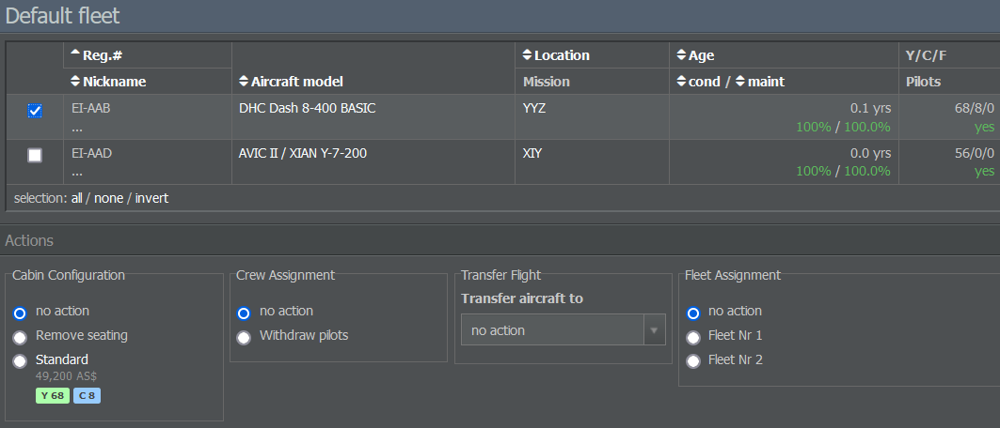

# 分配客舱与机组人员

既然你已经设置了客舱并雇用了员工，现在是时候将他们分配到你的飞机上了。

在“运营”选项卡中，点击“机队管理”，并选择你的飞机所属的机队。此刻，这很可能是默认机队，所有你购买和租赁的飞机都会被加入到该机队。

接下来，选择相应的飞机。这会打开一个操作面板，你可以在其中指定客舱和机组人员。你可以同时将一个客舱配置分配给若干同一机型变体的飞机。再次提醒，这不适用于货机。

在“机组分配”项下，你可能会发现选择了“无操作”，这表示驾驶舱机组人员已经被分配。请记住，你可以手动雇用飞行员，但如果需要，客舱乘务员会自动招募。

就像客舱一样，你可以对多架飞机同时执行与乘员相关的操作。请注意，如果没有关联的客舱配置，则无法分配客舱乘务员。
