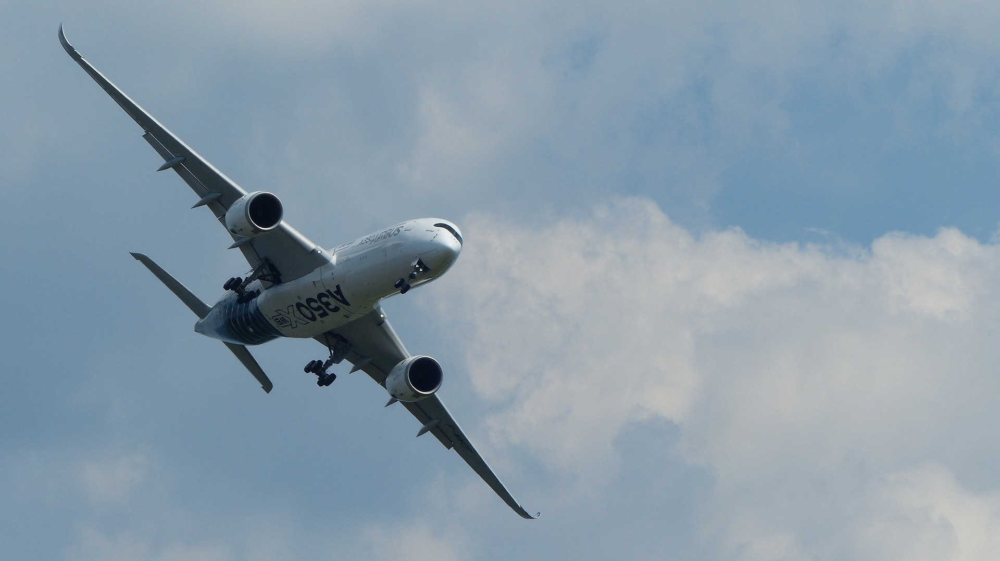
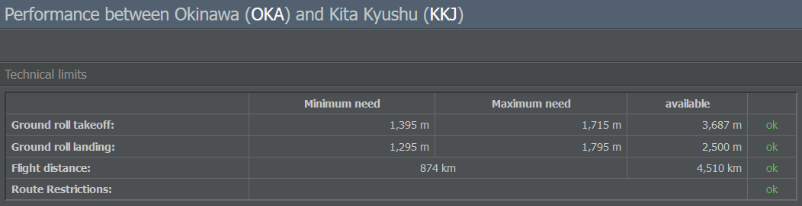
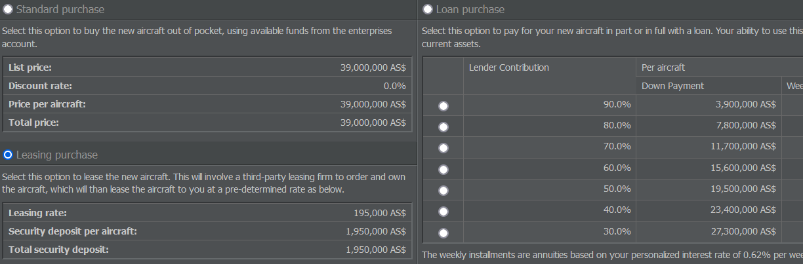
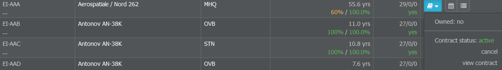

# 组建机队

公司成立后，您可能想开始租赁或购买您的第一架飞机。由于有各种各样的飞机可供选择，让我们从评估哪种飞机类型最适合您计划的运营开始。

## 选择飞机

首先，确定您希望您的飞机飞往何处可能会有所帮助。如果有构思一些可能的航线，您可以更好地了解您的机队将是什么样子。

### 国内航线

国内航线和飞往小型地区支线机场的航班为您的枢纽运输中转旅客，通常航程不超过1000公里。如果您选择使用Dash 8等小型涡轮螺旋桨飞机运营这些航线，您会发现它们比喷气式飞机慢。然而，在短距离航线上，这可以忽略不计。此外，大型飞机需要更多时间进行装卸。如果不重视时间，那么金钱就会成为问题。

请记住，小型飞机可能很便宜，但由于其尺寸，在高密度航线上处于劣势。有时，利用有限的航班时刻比节省燃料更重要。

### 中程航线

大多数飞机在1000公里到2000公里的航线上都能表现良好。例如，你可以选择波音737或空客318-321系列。两者都提供多种型号，具有不同的载荷和航程。如果你想节省燃料，可以选择737-700BGW，因为它在中程航线上燃油消耗最低。

一旦你雇用了机组人员，你会发现一名飞行员可以同时操作A318和A320。负责飞机维护的工程师也是如此。

### 长途航线

作为一家新航空公司，不建议从运营长途航线开始。通常，你只有1000万AS$的启动资金，而仅靠两架（大型且昂贵的）飞机和一个只有四个目的地的网络来运营一家盈利的航空公司可能会很困难。

相反，你可以从提供中短途航班开始。你的启动资金应该足够购买1到2架中型喷气式飞机和3到4架涡轮螺旋桨飞机，并留有一些储备。每架飞机每天可以飞行3到4个往返航班，让你从一开始就能建立一个小规模的网络。

### 新飞机 vs. 二手飞机

有了一些潜在航线后，你也可以开始考虑是为你的机队配备新飞机还是二手飞机。作为一家新航空公司，通常建议从二手飞机开始，这既是由于启动资金有限，也是因为二手飞机可以立即投入使用。

以下是一些需要考虑的要点：

* **燃油消耗/维护**：新飞机可能比旧飞机消耗更少的燃油，维护成本也更低。

* **乘客偏好**：老旧飞机（尤其是机龄超过20年的）通常对乘客没有太大吸引力，因此选择新飞机应该能让您销售更多机票并收取更高价格。然而，机龄并非唯一因素：通常，乘客更喜欢喷气式飞机而非螺旋桨飞机，更喜欢大型飞机而非小型飞机。

* **生产周期**：请记住检查飞机是否仍在生产中。购买生产数量很少的飞机可能会在未来因机队通用性问题而使您的运营复杂化。

* **交付时间**：如果您不使用您的1000万AS$启动资金，从制造商订购的新飞机可能不会立即交付，因为生产需要6-42小时，具体取决于飞机类型。二手飞机可以立即获得。（如果您从一条生产线订购多架新飞机，订单将添加到您的订单簿中。这不会受到其他公司的影响，除非它们属于您的控股公司。交付日期将显示在您的机队概览和订单簿中。您可以通过导航到飞机页面上的"运营商"部分来访问订单簿。）

* **价格**：二手飞机购买或租赁价格更便宜——有时会便宜很多，具体取决于飞机的机龄。

## 飞机类型评估

### 查找飞机

在仔细考虑了可能的飞机类型后，您可以通过导航到"管理"选项卡并选择"飞机制造商"来查看它们的详细信息。此页面按制造商分组显示所有可用的飞机类型。

选择一个类型会打开相关机型及其一般数据的概览，显示速度、航程和最大载客量等数值。如果您想了解更多关于某个机型的信息，只需点击它，其飞机数据表将为您提供所有相关规格。

让我们详细看看数据表中的一些数据：

* **载客量（最大）**：飞机的最大载客量。这只能通过使用基本座椅的单舱布局来实现。如果您想提供更多舱位或豪华座椅，飞机的载客量将会减少。请记住问自己您的飞机需要多大。例如，您可能不需要A380来往返两个小城市。如果您不确定，您总是可以看看竞争对手在做什么。

* **航程**：较小的值显示您在满载情况下可以达到的航程。较大的值显示最大航程，这只能在最小载荷下实现。您可以使用性能检查工具查看特定航线的载荷-航程图，我们稍后会谈到它。

* **起飞/降落滑跑距离**：飞机所需的跑道长度。较小的值是起飞或降落所需的最短长度；较大的值是满载起飞或降落所需的长度。

* **噪音类别**：这表示飞机的噪音排放水平，范围从 I（非常吵闹）到 V（非常安静）。噪音较大的飞机需要支付更高的地面费用，甚至可能被某些机场完全禁止。

* **维护类别**：同一类别的飞机在维护方面有相似的要求。请记住，维护多样化的机队可能会变得昂贵：一旦您的机队包含来自 3 个以上类别的飞机，每增加一个类别，维护费用将额外增加 15%。

### 性能检查工具

如果您想了解飞机在特定航线上的表现，请查看表格“技术规格”部分底部的“性能检查工具”。

在这里，您可以找到有关所选飞机和航线的所有相关信息，例如：

* 技术限制（跑道长度、距离、航线限制），
* 燃油消耗和最大有效载荷的详细信息，
* 飞行/周转时间，以及
* 空中交通管制和机场费用。

例如，这能让你检查你的计划目的地是否在你的飞机航程之内，并提供足够的跑道长度。不过要小心：飞行更长的航程需要携带更多燃料，因此你将无法搭载那么多乘客。

说到燃料：请记住，燃料消耗不是线性的——让一架大型重型飞机起飞需要很大的努力，但一旦升空，保持其在空中飞行就不需要那么多努力，因此适合长途飞行的飞机在航程较短时可能就不那么合适了。

### 比较机型

如果您想同时比较不同机型，请点击“性能检查工具”下方的链接。这允许您同时查看最多 4 种机型的详细信息。

若要比较选定航线上无限数量的机型，请导航至“运营”选项卡并点击“机型评估”。在此处，您可以查看燃油消耗、可用座位数以及航线成本。

不过，请留意显示的航班数量：例如，该工具可能显示一架飞机每周只能执行 28 趟航班（每天 2 趟往返航班），但您可能可以挤进第三趟（更短的）航班（例如，如果您选择了更省时的维护承包商）。

## 购置飞机

既然您已经决定了机型，是时候购置您的第一架飞机了！

您所选机型的飞机概况表提供了订购新飞机（如果仍在生产）或查看二手飞机报价的选项。

### 订购新飞机

如果您想订购新飞机，只需输入所需数量，然后点击“请求报价”。在下一页，您将有多种付款方式可供选择：

* **标准支付**支付全款购买飞机。

* **租赁支付**通过支付保证金和每周租金向出租人租赁飞机。如果您选择此选项，您的公司必须拥有足够的信用评级。如果您无法支付每周租金，飞机将自动退还。

* 通过信贷为飞机提供全部或部分资金，进行**贷款购买**。贷款和利息必须按照游戏的标准条件偿还。这种支付方式也取决于您的信用评级。所有可用的计划将自动提供。

由于您刚刚成立了第一家控股公司，您通常会获得 1000 万 AS$的启动资金，如果您租赁飞机，这笔资金可以立即交付飞机。一旦您超出此预算，您将不得不等待一段时间，因为飞机将一架接一架地交付。生产时间可能会有所不同，并显示在飞机概况介绍中。

### 订购二手飞机

如果您想订购二手飞机，请在飞机资料表的右上角选择“查看二手飞机报价”。这将带您进入飞机市场页面，其中显示了所有可购买的二手飞机。

二手市场允许您立即购买，或者使用现金、信用或租赁作为您的融资方式进行竞标。尽管可能需要一些时间，但通常建议竞标，因为它通常会便宜得多。

{}
**重要提示**  
如果您出价，您的资金将被冻结，直到拍卖结束。请记住，每次有新的出价时，拍卖计时器都会重置。
{}

市场上的每架飞机都附有额外信息：

* **所有者**：这显示了飞机的所有者以及您将从谁那里租赁或购买飞机。通常会是飞机贸易和租赁组织——一个由游戏运营的公司。
* **注册号**：飞机的注册号。
* **机龄**：飞机的机龄。这很重要，因为老旧飞机的维护成本更高，但通常更便宜。
* **保养状况**：飞机的最佳保养状况为 100%，但该值通常无关紧要，因为一旦购买飞机，就可以提高其状况。
* **位置**：这显示了飞机的当前位置。请记住，您需要将其转移到未来的运营基地。

### 购买还是租赁？

大多数新公司都是从租赁飞机开始运营的。除了非常小型或老旧的飞机，直接购买对于新手来说通常在财务上是不可行的。此外，租赁为您提供了灵活性，可以退还您可能觉得不适合您航线的飞机。相比之下，购买飞机可以避免每周的租赁费用。如果您有资产（在这种情况下是飞机）来降低风险，银行会很容易地给您贷款。

### 终止租赁

您和出租方都有权随时取消租赁合同。如果您希望取消租赁，请前往“运营”选项卡，选择“机队管理”，找到相关飞机，然后点击显示“合同详情”的小书本图标。

请注意：飞机将在下一次周分期付款到期时归还给出租人。您将收回您的保证金，并被收取最后一笔租赁分期付款。

终止期后安排的任何航班都将被取消，并且将对已预订的任何乘客/货物收取取消费用。
飞行员和空乘人员将作为冗余人员保留，直到您重新培训/重新使用他们或解雇他们。
