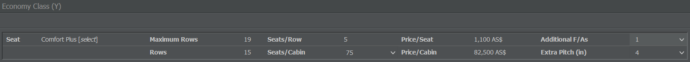
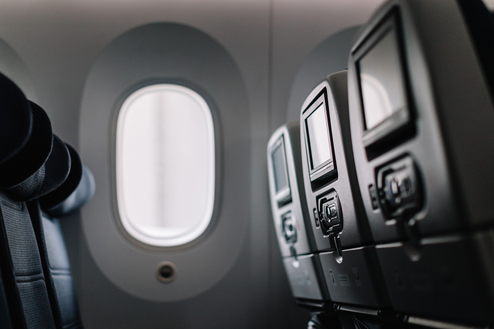

# 客舱配置

在起飞之前，你需要为飞机配备客舱并配置座位布局——无论你拥有的是新机还是二手机。让我们看看如何操作吧！

{}
**信息**  
如果你想运营货机，则无需执行此步骤。尽管不是最理想的配置，但所有新飞机上都已配置了一个默认布局。
{}

## 使用客舱编辑器

转到“商业”选项卡并选择“客舱配置”。此页面显示您所有现有的配置。要创建新的配置，输入名称，选择它应适用于的机型，然后点击“创建新配置”。

客舱编辑器显示有关机型、其乘客容量和配置状态的信息。在这些信息旁边，您会看到“保存配置”按钮。切勿忘记保存配置，否则您将不得不重新开始！

在编辑器的左侧，您会看到飞机的空甲板。首先，点击"新增舱等"，选择一个舱等（经济舱、商务舱或头等舱）添加到甲板。您可以按喜好为飞机配备任何舱等，但请记住三舱布局通常用于大型飞机。如果一架飞机有两个甲板，您可以分别配置两个甲板（主甲板和上甲板）。

设置好舱位等级后，你可以为每个舱位配置座椅并增派乘务员：

* **座椅类型**：点击“座椅”旁的“选择”，你可以决定在每个舱位放置哪种类型的座椅。更好的座椅会带来更高的评级，但通常更昂贵且占用更多空间，从而减少你能运载的最大乘客数量。这总是在质量与效率之间的权衡：如果你在一条航线上是唯一一家航空公司，你可以尽量提供更多座位；如果一条航线竞争激烈，最好提供更舒适的座椅。

* **座位数量**：你可以在“舱等座位数”下选择座位数量。如果选择 0，该舱位将在客舱配置中不被使用。如果你已经在其他舱位添加了座位，可以使用“top up”按钮用当前编辑舱位的座位填满剩余空间。

* **额外腿部间距**：如果你想为乘客提供更多的腿部空间，不必减少座位排数——只需增加额外腿部间距值即可！

* **额外的乘务员**：在这里，你可以为每个舱位增加额外的空乘人员。你应该已经有了基础的员工数量，但可以分配更多员工以提升评分。提示：座位少于 20 个的飞机不一定需要空乘人员。默认情况下，每位乘务员负责每个舱位的 50 名乘客。更多的乘务员会对航班评价产生正面影响。

如果你不确定当前配置如何影响乘客评分，只需保存并切换到评分选项卡查看。并且请记住：每种机型都需要其各自的客舱布局！

## 配置建议

以下是一些关于客舱配置流程的一般建议：

* **每个舱等至少一名乘务员**：每个舱等至少需要一名乘务员。即便你只装了两个头等舱座位，你仍然必须为头等舱分配一名乘务员。请记住，员工工作 8 小时轮班，因此如果你的航班每天飞行 20 小时，一名乘务员在工资单上就相当于多名员工。

* **额外的乘务员**：额外乘务员的数量由你决定，但乘客肯定喜欢更周到的照顾。更高的评分可能值得支付额外的薪酬。

* **经济舱与商务舱**：由于商务舱通常座位更大、服务更好且每名乘务员负责的乘客更少，两个经济舱乘客可能比一个商务舱乘客更有利可图。只要设置客舱时记得把成本考虑进去。

* **头等舱**：如果你发现某些航线很难把头等舱坐满，可以尝试只在 2000 公里及以上的长途航线上提供头等舱，或者在某些飞机上干脆不设置头等舱。

* **检查您的配置**：创建客舱后请再次仔细检查。一旦在下一步将其分配给飞机，您甚至无法在不对飞机进行全面翻新的情况下新增乘务员。

* **更改客舱**：如果您更改了飞机的客舱配置，新设置将在 3 天后生效。

## 乘客有什么期待？

这完全取决于你的航线和营销策略：如果你想经营低成本航空公司，就在飞机上安装窄座椅并出售更便宜的机票。如果你是在建立一家更为普通的航空公司，则为飞机配备稍好一些的座椅。大多数飞机的座位配置为 80%经济舱和 20%商务舱，但当然你可以按照自己的喜好自由分配座位。

在短途航线，乘客对基础座椅应当可以接受。在中程航班上，你可以为某些舱位配备更高级的座椅。如果乘客稀少且竞争激烈，你可以尝试为经济舱乘客使用更好的座椅。
