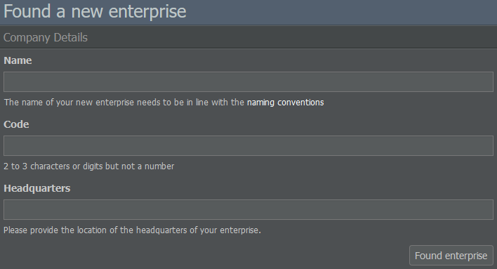
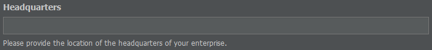

# 公司设置

## 规划公司结构

创建AirlineSim账户并选择游戏世界后，考虑如何构建公司会很有帮助，尤其是在该世界支持[首次公开募股（IPO）]()的情况下。

虽然您可以将您建立的第一个控股公司用作普通航空公司，但您无法通过它完成上市。如果您有兴趣启动IPO，您需要创建另一个企业作为现有控股公司的子公司。一旦您上市，该子公司就可以在股票市场上交易。

[点击此处]()了解控股公司和子公司之间的更多区别。

## 命名您的公司

现在您对公司的结构有了一个大致的了解，让我们在游戏中进行设置吧。

您只需点击屏幕顶部显示"暂无航空公司？"的蓝色条幅，然后在下一页输入您新公司的名称。请务必遵守命名规范，以确保所有玩家都能享受游戏的乐趣。

系统还会提示您输入公司代码。代码必须包含两个或三个字母或数字，但不能是纯数字。由于代码不能被其他公司使用，如果代码已被占用，界面会显示警告。请务必注意此代码日后无法更改。

## 选择国家/地区

接下来，我们来确定您的航空公司总部位置。请注意，您选择的国家/地区将影响适用于您的控股公司及其子公司的航权，因此请谨慎选择。它还可能影响您的机队：如果您在偏远地区创办航空公司，您将需要大型且昂贵的飞机才能将您的枢纽与世界连接起来，除非您不介意自己的发展更多仅限于区域航线。

一开始，建议选择竞争较少的国家/地区，这样您的飞机更容易满载。如果您不确定某个国家/地区的情况，请通过查看其在游戏中的评级和一般活动来检查其现有的一些公司。至于城市，选择一个国家的首都可能会有所帮助，因为它通常是乘客的目的地。

当加入一个已经运行了一段时间的游戏世界时，查看您所需机场的可用时段是很有帮助的。

{}
**信息**  
您可以通过在游戏搜索栏中输入机场名称，然后导航到机场信息页面的"时段"选项卡来查找特定机场的时段分配情况。
{}

如果您看到很多橙色和红色，您可能需要寻找另一个枢纽，因为起降都需要时间，并且时段在创建您的航班时刻表中扮演着重要角色。

为了帮助您作出决定，这里有几个不同国家及其作为枢纽地点的例子。

### 西班牙

作为欧盟成员国，整个欧洲都是你的国内市场，这意味着你可以在欧盟内的任意两个机场之间运送乘客（参见[交通权]()）。唯一的问题是：所有其他欧洲航空公司都拥有同样的优势。总而言之，如果您计划建立多个枢纽、希望拥有大量乘客且不介意激烈的竞争，那么欧洲是一个不错的选择。

### 美国

另一个巨大的市场，大到足以建立多个枢纽。由于它是一个国家，你可以从每个美国机场飞往国际目的地。但是，与欧盟一样，竞争可能相当激烈。

### 墨西哥

墨西哥提供了一个不错的国内市场，因为它拥有许多机场，并且只有墨西哥航空公司才能在这些机场之间运送乘客。您将在国际航线上遇到来自外国航空公司的竞争，但您的国内航线应该会受到更多保护。显然，与美国相比，国内市场要小得多。

### 巴基斯坦

这是一个对外国投资者开放的国家的例子。起初，您可能会认为您找到了一个拥有良好国内市场且本地竞争较少的国家。

然而，如果它对投资者开放，世界上每家航空公司都可以利用它来创建子公司。一个最初看起来平静的地方，可能会随着大型航空公司开始寻找扩展业务的地点而变得更具竞争力。

{}
**信息**  
一个国家是否接受外国投资取决于游戏世界。你可以通过导航到数据库选项卡下的"国家"部分，选择一个国家并查看"无限制市场准入"下的内容来检查。
{}

## 创建控股公司和子公司

一旦你对公司的名称和总部感到满意，你就可以点击"创建企业"。恭喜，您刚刚创办了您的第一家企业。

如果您想创建另一家企业，只需将鼠标悬停在带有您的航空公司名称的下拉菜单上，然后选择"创建新企业"。

接下来，您可以指定是想成立另一家控股公司，还是想创建现有控股公司的子公司。

{}
**重要提示**  
请注意：并非所有游戏世界都支持运营多家控股公司。如有疑问，请点击左下角世界名称或[我们的博客](https://www.airlinesim.aero/blog/)上查看该世界的配置。如果允许运营多家控股公司，请记住，根据我们的游戏规则，它们之间禁止合作。
{}

在设立子公司时，您必须决定它将从您的控股公司获得多少启动资金，最低为300万AS$。请考虑您想投资多少，因为您将没有机会再从控股公司向子公司转账，反之亦然，除非在通过首次公开募股（IPO）之后向您的控股公司和外部投资者支付股息。

除了启动资金外，请注意您的控股公司所在的国家决定了其子公司的航权：如果您的子公司枢纽与控股公司位于同一国家，您将拥有完整的航权，否则可能会受到限制。
