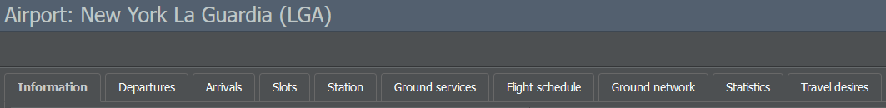
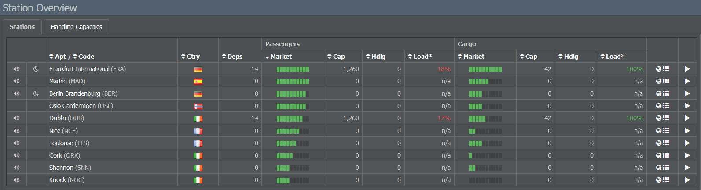

# 创建航线

您已成功获得第一架飞机，现在让我们开始规划您的航空公司航线吧！经过之前的步骤，您可能已经对想要飞往的地点有了大致的了解，但现在我们将深入探讨细节。

## 查找机场信息

如果您对某个特定机场感兴趣，可以通过在屏幕顶部的搜索栏中输入其名称或 IATA 代码来搜索。机场页面提供了许多详细信息，但目前，我们将重点关注“信息”选项卡。

在这里，你可以找到机场的跑道长度、规模、吞吐量（每 5 分钟窗口可进行的航班数量）、最短中转时间、夜间禁飞、噪音限制和需求等数据。

由于需求会影响你的航线，我们来看看在创建航线时如何考虑它！

## 考虑需求

机场的需求由两个绿色条显示：一个表示客运需求，另一个表示货运需求。自然，两个大城市之间的客流量会比两个小城市之间的客流量大，因此在规划航线时请记得关注需求水平。

### 国内需求

旅客总是希望飞往他们国家的首都，因此建议选择一个首都城市作为您的枢纽，并将您的国内航线与国际航班连接起来。

一个良好的国内航线网络有几个优点：它为您的国际航线提供中转旅客，并使您成为一个有吸引力的联运伙伴。此外，在某些国家，由于国内市场受到更多保护，它可能相当有利可图。

### 实际需求

在许多情况下，游戏会反映现实生活中的需求：西班牙与拉丁美洲之间，或者英国与印度或澳大利亚之间，旧有的联系依然存在。奥地利与前共产主义国家有许多联系，而小小的加那利群岛吸引着成千上万的游客。

在比较不同航线时，你可以利用这一点！查看[FlightStats](http://www.flightstats.com)等网站，获取真实航班的信息。

## 查看游戏中现有航线

除了需求之外，查看游戏中现有航线也很有用，尤其是在你加入一个已经运行了一段时间的游戏世界时。如果有多家公司在两个机场之间提供多个航班，那么您很有可能还能再增加一个航班。

## 将您的枢纽变成真正的枢纽

我们已经讨论了拥有良好国内网络的优势，但这里有一些关于创建往返枢纽连接的通用建议。

首先，尝试设置不同方向的航线，因为乘客会前往您的枢纽并搭乘转机航班。查看机场的最短中转时间，以确保乘客能够赶上航班，但请记住，他们也不会等待超过 8 小时的转机航班。

如果您的航班以波次形式抵达和起飞，您可以创建无数可能的连接。无论您的基地国家有多小，您都可以建立一个出色的国际网络！

## 延长航程

在决定航线时，检查飞机的航程会有所帮助。每架飞机在满载情况下都能飞行一定的距离。它可以飞得更远，但那样就会携带更多的燃油，载客量也会减少。如果你想延长航程，为你的飞机配备更好的座位。这将在[在线预订系统（ORS）]()上获得更高的评分，并且你仍然可以满载飞行（即以更高的票价搭载更少的乘客）。

## 利用你的地理位置

最后但同样重要的是，考虑你的地理位置如何影响你的航线选择。虽然这可能是一个限制因素，但它也为你带来了优势：例如，如果你在中东，你的航线可以连接欧洲和亚洲。墨西哥的航空公司可以使用像 737 这样的中型喷气式飞机到达美国大部分地区和南美洲的一半。非洲没有那么多主要机场，但一些非洲国家已经签署了《亚穆苏克罗决议》，这使得经停航班变得有趣（参见[航权]()）。

## 开设航站

考虑到所有这些因素，您就可以确定航空公司的航线了。一旦您对航线满意，就可以通过在所需机场开设航站来在游戏中设置它们！

您的第一个航站已在您的企业所在地开放。要开设新航站，只需导航到机场页面并点击“开设航站”按钮。您也可以查找一个国家/地区以查看其机场列表并从那里设置航站。

另一个选项是点击“运营”选项卡并选择“航站”。在右侧的“开设新航站”面板中，您可以输入航站的确切名称或 IATA 代码，然后点击“开设航站”。请注意，您无需在机场建造航站楼来处理乘客——我们假定公共设施已经存在。

开设或关闭航站不收取任何费用，只要该航站未被实际使用。

但是，一旦您开始安排飞往该机场的航班，处理旅客就会产生人员成本，相关员工会根据您预计在该航站处理的旅客数量自动雇佣。

* **航站经理**：目前未使用，不会被雇佣。
* **值机接待员**：负责旅客处理。如果机场仅用于货运，则不需要且不会雇佣。
* **机坪地勤员**：协调飞机的地面勤务。
* **货运管制员**：负责货运处理。如果机场不处理货物，则不需要或不雇用。

如果您减少需要处理的乘客或货物数量，以至于员工需求减少，则员工将可用于其他航站。

可用员工可以被解雇（尽管您必须支付他们遣散费）或用于满足其他航站以后可能增加的额外员工需求。这是自动完成的：闲置员工将在需要时被调动，然后才会雇用新人。
