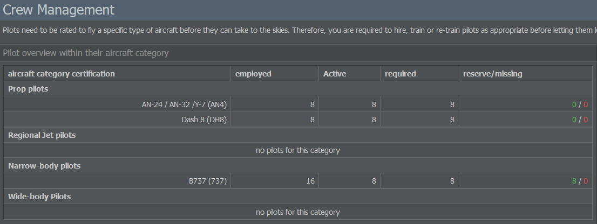
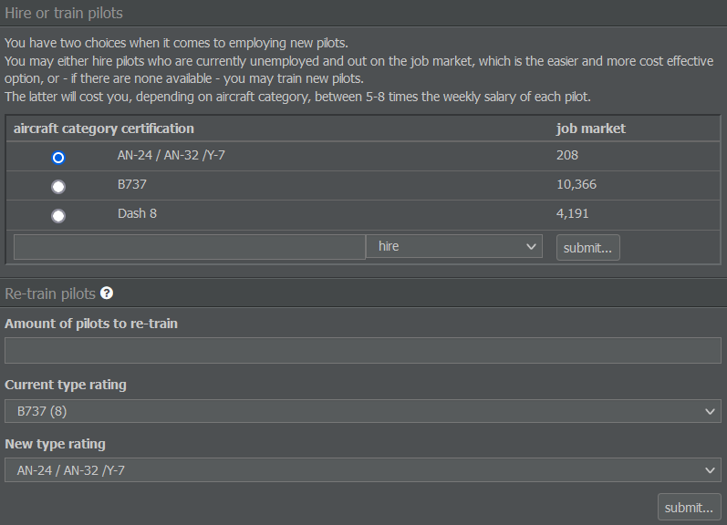
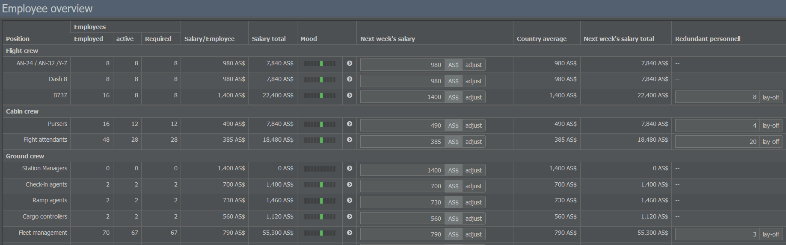

# 招聘员工

在航线设置好之后，我们来看看你的员工吧！

## 招聘飞行员

一架飞机需要飞行员来驾驶，所以我们必须先雇用或培训他们。部分机组人员被默认添加，但现在让我们看看如何手动雇用飞行员。

首先，选择“管理”标签并进入“机组管理”。在左侧，你会看到按飞机类别分组的在职和所需飞行员名单。由于飞行员无法全天工作，所需飞行员的数量通常高于实际完成一次航班所需的数量。例如，如果你的飞机每天飞行 20 小时，则需要三组机组来操作它，并且需要第四组机组来替换病假或休假的飞行员。

靠右的绿色数字显示的是备用飞行员的数量，而红色数值则表示还需要补充的飞行员人数。请记住，除某些机型外，一架飞机通常需要一名机长和一名副驾驶。

列出的飞机类别分为涡桨飞机、支线喷气机、窄体和宽体飞机。它们表明飞行员被允许驾驶的飞机类型，此分类也可以在“飞机制造商”页面找到。

若要为您的机型找到合适的飞行员，请查看右侧菜单：在这里，您可以从就业市场中雇用失业飞行员或培训新飞行员。。两种选择都会立即为您提供飞行员。然而，培训一名飞行员的费用将是雇佣所花每周工资的 5 到 8 倍，具体依飞机类别有所不同

如果您由于飞机出售或租赁到期而有已雇佣但未执飞的飞行员，也可以选择对他们进行再培训以操作另一种机型。再培训的费用显著低于培训新飞行员，因为现有员工具有一些可通用的飞行经验。

## 管理员工

如果您想查看员工的总体概况，请在“管理”选项卡中点击“人员管理”。在这里您可以看到员工数量、雇佣状态、情绪和工资明细。

该列表按职位对员工进行分组：飞行员、机舱乘务员、行政人员等。除飞行员外的人员若有需求会由系统自动雇用；不过你可以在工资栏输入所需数值并按“调整”来控制他们的薪酬。

请记住，自动系统只会雇用必要人员——如果你不再需要他们，它不会解雇他们。要解雇机组或员工，请在“多余人员”一栏的字段中输入要解雇的员工人数，然后选择“裁员”。

{}
**重要提示**  
解雇员工并非免费——你需要支付一次性的遣散费，相当于数周的默认薪资，因此在决定解雇员工时，值得考虑你的解雇理由是涉及短期还是长期的利益。
{}
