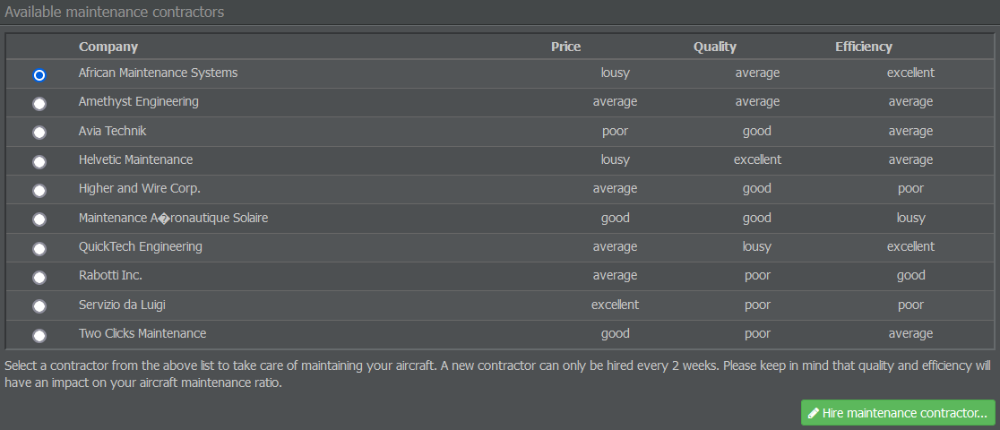

# 维修保养

## 预订维修保养

好吧，你已经把飞机、航线、服务、员工和客舱都安排好了——可以开始飞行了？还不行，你还需要一个维修服务提供商！如果没有维修，你的飞机不会飞得太久……

在“运营”选项卡中，选择“维修保养”，然后为你的飞机选择一家提供维修服务的公司。有几种选择，各有优缺点。每个提供商在价格、质量和维修时长方面都有不同的数值。

* **价格**：这表示对同等工作量的飞机维修所需相对费用。
* **质量**：这表明维修标准。注意：低质量的供应商可能永远无法将你的飞机修复到 100%状态。
* **效率**：这表示在特定时间段内完成的维修量。非常高效的供应商在更短时间内能完成比低效供应商更多的工作；不过，如果你的飞机在地面停留时间很长，这样做可能不划算。

{}
**重要提示**  
一旦你选择了维修公司，在两周内无法更改。
{}

在考虑维修时，尽量不要先看价格。相反，应选择一个适合你计划运营的供应商。

你也可以稍后再选择维修供应商，但如果你打算很快准备飞行计划，现在最好就选定一个。之后更换供应商会影响飞机能在空中飞行的时间，并决定它们每天必须停留在地面的时长，因此你可能需要相应调整飞行计划。

## 额外提示

以下是一些关于维修及其如何融入你的飞行时刻表（我们很快会讨论这个内容）的建议。

* **最短航班计划间隔**：如果你希望在航班之间进行维修，你的航班时刻表需要保留至少 120 分钟的间隔（包括周转时间）。地面时间为 119 分钟或更短时，将不会进行任何维修。

* **价格、质量还是效率？** 具有每日维修窗口的对称航班时刻表允许你选择既高效又便宜的维修承包商。然而，非对称时刻表可能会使你从关注价格转向选择提供更高质量维修的承包商，以减缓飞机状况的恶化。

* **自有飞机**：拥有飞机可以使你的航班计划不那么紧凑。你可以不把时刻表塞得太满，为航班接驳留出间隔。选择更便宜的供应商在某些情况下可能值得牺牲质量和/或效率，从而降低每趟航班的维修成本。听起来奇怪？不！现实生活中这一策略的例子是[Allegiant Air](http://en.wikipedia.org/wiki/Allegiant_Air#Costs)。

* **机龄**：飞机的机龄不会影响维修所需的时间，但会影响费用。飞机越老，维修时使用的备件就越多，因为故障和磨损会增加其需求。
