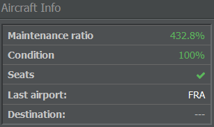
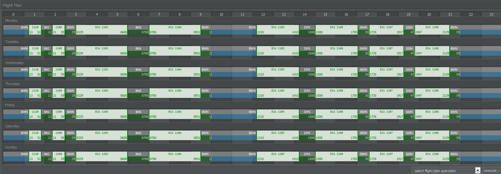
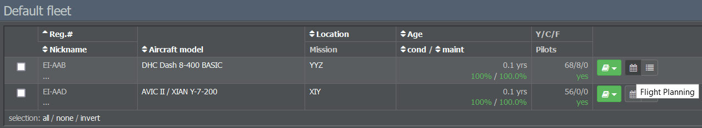
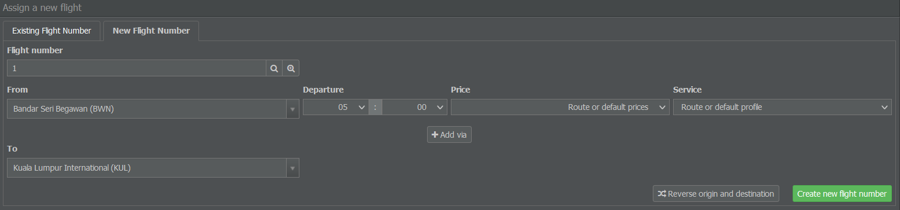
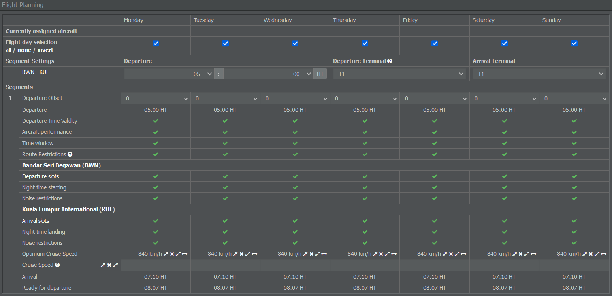
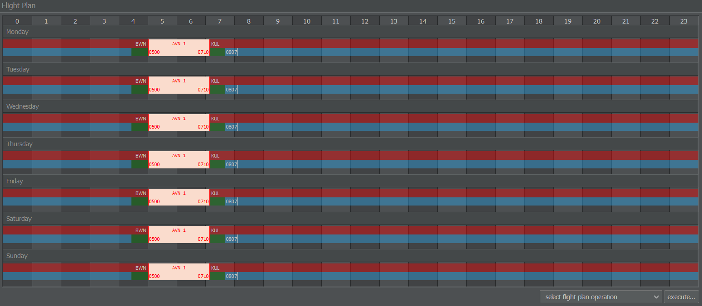
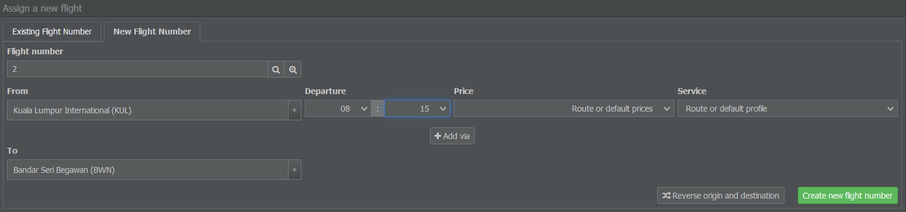
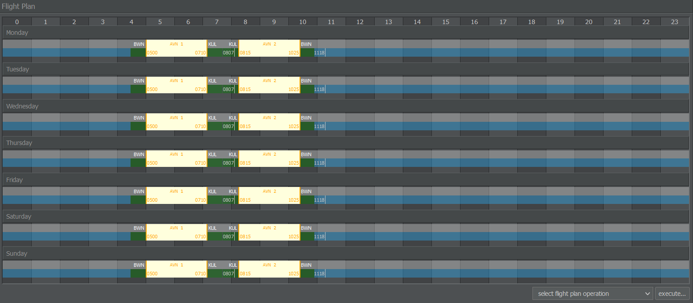
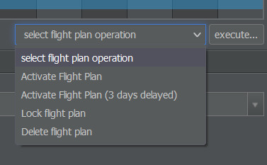
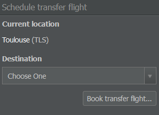

# 安排航班

有了维修供应商就绪，终于可以让你的飞机起飞了！这可能非常简单，也可能有些复杂，取决于你的位置、你的航空公司想要实现的目标以及你面临的竞争程度。

本教程将着重于制定一个基本的航班计划并使其运行起来，但完成之后，许多更高级的概念应该会变得相当明显。

## 制定航班时刻表

在我们开始之前，先通过观察一些相关参数来考虑如何设置你的航班计划。

### 保持盈利

如果你在租赁飞机，即便飞机未起飞，你也必须支付每周租赁费以及飞行员和机组人员的工资。

如果你的飞机每天执行一次往返航班（从 A 到 B 再从 B 回 A），则每次航班的租赁成本等于每周租赁费除以 14。如果你的飞机每天执行三次往返航班，则每次航班的租赁成本等于每周租赁费除以 42。

因此为了保持盈利，你的飞机必须尽可能多地飞行。

### 维护比率

在航班规划页面的“飞机信息”部分（我们待会儿会讲到），你会看到飞机的维护比率。该数值显示飞机的维护与飞行的比率，可作为其效率的一个指标。一般来说，比率越高，你通过该飞机获得的收入就越少。

在航班计划和维护方面，有几点需要注意：首先，维护是自动安排的。排程表中以浅蓝色背景表示。只要飞机在地面，它就会在任何机场进行维护。然而，为了成功执行维护，你的时刻表需要在两次航班之间安排至少 2 小时的空档。

如果飞机没有排定航班，维护比率为 100%。在计划第一次返回航班之后，你可能会注意到维护比率变高，但通过安排更多航班可以将其降低回 100%。

{}
**重要提示**  
维护比率低于 100%意味着航班计划没有留出足够时间供维修人员进行修理，这会导致飞机状况每天下降。一旦下降到 50%以下，飞机将被停飞，禁止执行航班直到修复完成。已预订的航班将被取消，乘客会获得退款。
{}

为防止这种情况发生，请根据飞机的使用年限、机型和航班计划安排每周维修时间。对于短途和中程航线，应允许每天进行维护。乘客会更喜欢维护良好的飞机，因此你也会获得更好的评分和更多预订。

如上所述，维护在每个机场进行，而不仅仅是在你的枢纽。不过在枢纽预留维护时间有时很实用。这样一来，乘客有足够时间转乘（即如果你所有的飞机大致同时到达并在大约两小时后离开）。当你其他的航班波次到达时，只需让飞机在地面停留最低换乘时间。

### 最低换乘时间与周转时间

每个提供换乘的机场都有一个最低换乘时间，可在机场信息页面查看。这是乘客赶上转机所需的最短时间。乘客在飞机着陆后即离机，通常是在飞机准备下一班航班前大约半小时。

当你查看航班时刻表时，可以看到其同时显示航班时间和周转时间。周转时间包括飞机到达后至再次准备出发之间发生的所有活动。特定航线的确切周转时间可通过性能检查工具查看。

{}
**信息**  
不完整的周转（因航班之间时间不足）会导致航班运营延误。留出一些额外的缓冲时间也有好处，这样你的运营就不容易因影响航班和地面作业的随机扰动而产生连锁延误。
{}

### 综合信息，制定计划

考虑到相关成本、维护比率以及中转/周转时间，让我们制定你的航班时刻表。

使用性能检查工具查看所需航程的飞行时间。接着，将航班分配到你的飞机上，使每架飞机的维护比率尽可能接近 100%。如果维护比率超过 200%，说明你的飞机在地面浪费了宝贵的时间。

一旦你对航班时刻表满意，我们就可以在游戏中设置它！

## 创建您的第一个航线

首先，在“运营”选项卡中选择“机队管理”，并选择分配给该飞机的机队。如果您没有更改机队分配，可以在默认机队中找到该飞机。

每架飞机旁都有三个图标：最左边的小书显示飞机的合同详情，第二个图标带您进入时刻表界面，第三个图标显示该飞机当前的航班。

点击排班图标会带您进入一个显示空排班表的页面。在这里，您可以创建您的第一个航班号。

要添加新航班：

* 输入一个新的航班号（不含航空公司代码）。
* 选择出发机场和时间。
* 选择票价等级和服务配置（如果你选择通过“商业”选项卡下的“库存”部分管理票价和服务，也可以保持默认）。
* 选择到达机场。
* 点击“创建新航班号”。

{}
**信息**  
如果您选择的出发或到达机场未列出，请确保您已在该机场开设了一个航站。
{}

创建新航班号后，航班规划部分将会出现。

对于每周的每一天，它会告知你所需的航程是否可行。如果不可行，你会看到一个红色的叉号，在这种情况下你可以尝试更改出发时间。要安排航班，所有字段都必须显示绿色的勾号。

默认情况下，航班将被安排在每周的每天运行（你可以在游戏设置中更改此项）。如果你不想每天运营（或由于时刻限制无法每天运营），可以单独选择/取消选择每一天。

当所有检查都显示为绿色时，点击“应用计划设置”以创建航班并将其分配给你的飞机。

## 安排返程航班

在保存航班后，你可以在航班计划部分点击该航班以查看航班编号的详细信息。在这里，你可以编辑票价和机上服务，既可以针对该具体航班，也可以针对整个航线进行设置。

你还会注意到时刻表上显示了一系列令人惊讶的红色方格，但别担心——这是因为我们到目前为止只计划了一个方向。没有返程航班，飞机将会被困在目的地机场，可能无法继续执行后续航班。

但是，你并不需要立即返回到同一目的地，循环航班（例如机场 A 到 B 到 C 再到 A）也是可以的。

默认情况下，排程表单会自动填写一个新的航班号、回程航班的机场对以及基于前一班航班给出的新的时间建议。如果你想飞往其他目的地或在更早/更晚的时间飞行，可以更改这些设置。

如果您对设置满意，可以点击“新建航班号”来安排回程航班。

像之前一样，航班计划菜单会出现。在确认所有字段均显示绿色勾选后，你就可以应用时刻表设置。

{}
**重要提示**  
如前所述，务必在航班之间留出足够的时间窗口。如果您的出发时间设定早于飞机准备就绪时间，航班会变成红色，时间窗口部分会显示红色叉号。此时请调整出发时间以避免航班重叠。
{}

一旦您成功安排好回程航班，航班会变成黄色。这表示计划已正确设置，且没有缺失或中断的航班。

## 激活航班时刻表

现在您的第一个时刻表已准备就绪，是时候允许[在线订票系统（ORS）]()向您的航班添加乘客和货物了。

还记得那些黄色的航班计划框吗？那表示你已成功占用了时间窗，但还没有人能预订这些航班。要想获得预订，你的航班首先需要被激活！

{}
**重要提示**  
如果不激活，航班将在几天后被删除以防止占用时间窗。
{}

你可以通过在航班时刻表下方进入“飞行计划操作”菜单来激活你的航班计划。你可以选择立即激活航班计划，或选择延迟三天后生效。

延迟设置有助于在更改现有航班时避免混淆。已经根据旧时刻表预订的航班将在票务系统中开始使用新时刻表前完成飞行。如果你不确定飞机在一天内是否能够被全部订满，这一设置也很有用。

在选择某个选项后，你的已排班航班会变为绿色，这意味着你的航班计划已成功激活！

## 转移飞机

您的航班在启用时刻表后至少在 30 分钟后出现。第一次实际飞行不会早于系统收到飞行计划后24 小时。点击机队管理页面中飞机条目最右侧的小图标，可以查看所有可供旅客或货运预订的航班列表。

要执行这些航班，你的飞机必须位于列表中第一个出发机场。如果你的飞机位于其他地方，你需要通过航班计划页面右侧的“安排转场航班”菜单添加一趟转场航班。

在这里，您可以选择想要的机场。飞机随后会被调配到新的目的地，转场航班会出现在列表中——无需调整时间窗。调配完成后，该航班会消失。请注意，转场是免费的，但需要一些时间才能完成。

你也可以选择取消任何不合适的航班，而不是预订转场航班。只要航班为空就不会有取消罚款。然而，如果你取消已经有预订的航班，则必须退还机票款。

## 等待第一批乘客

干得好！现在你的飞机可以开始迎接第一批乘客登机了。

您可以继续为其他飞机安排航班，或等待您的航班载满。每个机场每天会将其票务需求分配到可用航线上。具体时间可以在机场信息页面的“需求计算”部分找到。

机票会提前最多三天被预订，因此您只能在起飞时确定实际被预订的乘客/货运单位数量。当您的飞机起飞时，该航班的所有收入和支出将计入您的账户。维修费用在完成后支付，而人员成本、租赁合同和贷款将按周扣除。
