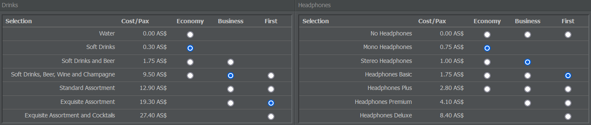

# 定义服务配置

## 饼干 还是 鱼子酱？

还记得以前航空公司在每趟航班都提供免费饮料和报纸的日子吗？这给他们增加的成本并不高，但乘客很欣赏这种服务。

我们的虚拟乘客也喜欢被精心照顾！幸运的是，良好的机上服务——饮料、餐食、报纸等——并不昂贵，而更高的评分绝对物有所值。

商务舱和头等舱的乘客更难取悦，但既然你提供头等舱座位，为何不提供头等舱服务？安装大座椅却出售廉价票并不划算，因为乘客会不喜欢你的服务。

当然，服务配置并非强制要求。一旦你为飞机配备了座椅、乘务员和飞行员，飞机就可以起飞，因此你可以选择减少机上服务并将节省下来的费用反映到更低的票价上。然而，良好的机上服务会使价格不变的航班对顾客更具吸引力。

## 创建与分配服务配置

如果你想设置服务配置，请转到“商业”选项卡并选择“服务配置”。你可以在右侧输入名称并点击“创建配置”来新建一个。

在下页中，你可以为每个舱等（商务舱、经济舱、头等舱）定义想要提供的机上服务。可选项分为食品部分（包括饮料、小吃、主菜和第二餐）和非食品部分（可选择耳机、餐食包装、报纸和杂志）。

每个服务选项都可以查看其相关成本。你还会看到关于这些选择如何影响乘客评分的概览。

关于最佳且最经济的设置并无固定公式。机上服务的选择取决于你的航空公司定位：如果你打算经营低成本航空，乘客的待遇可能不会奢华，因此在设置服务配置时请牢记你的商业计划。

完成后，你可以返回概览并将其中一个可用的服务配置设为默认。这样在创建新航班时（只要这些航班没有适用距离限制）将自动应用该默认配置。

{}
**信息**  
有些餐食要求航班的航程至少为 800 或 1500 公里，因此如果你的默认服务配置文件包含这些餐食中的任何一种，它将不会应用于航程较短的航班，游戏会将配置留空。 因此，可能需要为短途和长途航班创建不同的服务配置文件。
{}

开始创建航班号，或者在“商业”标签下访问航班库存页面时，也可以手动分配服务配置文件。
