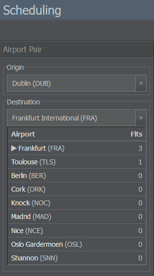
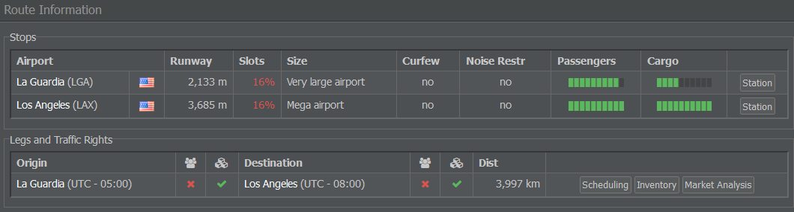
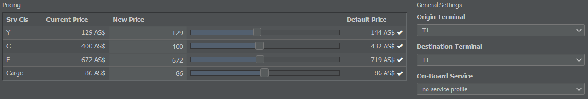
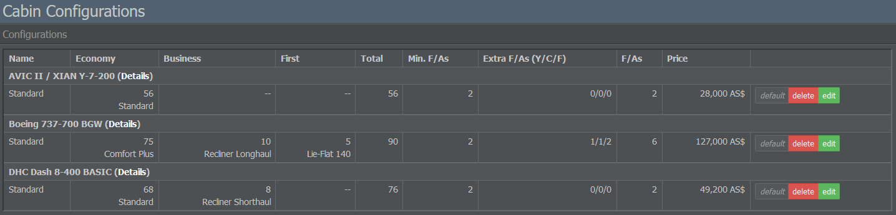
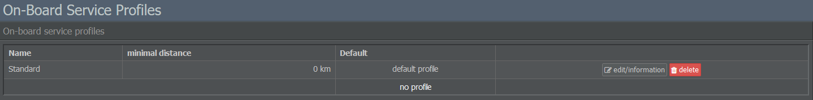
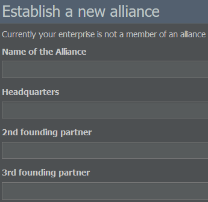

# 商业菜单

此部分菜单由航线网络规划、销售与分销、产品与客户服务以及业务拓展四个部分组成。

## 航线网络规划

### 航班排程

在此，您可以管理特定航线的航班时刻表。在左侧选择一个机场对后，您将获得相关航班号和产品评级的信息。

在页面标题下方的文本字段中，您可以快速切换到另一个机场对。代码必须为 AAABBB 格式，其中 AAA 和 BBB 为各自机场的 IATA 机场代码。

### 航班号

在此菜单中，您可以查看航空公司的航班号，将其分组或创建新的航班号。如果要设置新的航班号，请在左侧菜单中选择出发地和目的地。所谓的经停航班可以包含一个中途停靠（技术经停），可在相应部分添加。

### 航线评估

航线评估工具可提供您所选航线的相关信息。只需在左侧输入出发地和目的地，即可获取关于跑道长度、时间窗可用性、机场规模、噪音限制、需求水平和航线距离的详细信息。您也可以选择创建新的航班号。

### 市场分析

本页概述了所选航线对的当前市场状况。即当前可预订的航班、座位运力与价格变化，以及竞争航空公司的市场份额。

“市场份额”部分直观显示了你和竞争航空公司在客运和货运方面控制的市场份额。在图表上方，你可以在不同周的数据之间切换。

{}
**信息**  
市场分析页面的主要目的是监控竞争对手并评估新市场。要监控你自己的载客率，可以使用[库存](#inventory)或[负载监控](#load-monitoring)页面。
{}

请注意，其他航空公司的航班可用座位数只会显示到 9：如果相应航班和舱位的剩余运力高于 9，则显示为 9。否则，该数值即代表实际剩余运力。

在页面标题下方的文本字段中，您可以快速切换到另一个机场对。代码必须为 AAABBB 格式，其中 AAA 和 BBB 为各自机场的 IATA 机场代码。

## 销售与分销

### 定价

使用此菜单，您可以轻松调整机票价格。只需选择一条航线、一个服务配置和一个舱位，输入价格变动的百分比，然后点击“更改价格”。您可以对标准价或当前价增加或减少一个百分比。请注意，您的价格必须在默认价格的 50% 至 200% 之间。

### 库存

库存系统管理并控制航空公司可供销售的可用运力。本页面允许您查看载客率、更新票价、航站楼和服务配置、获取运力和预订的详细信息，并审阅所选机场对的历时载客率和定价数据。

您可以使用页面标题下方的文本字段快速切换到另一个航段。代码必须为 AAABBB 格式，其中 AAA 和 BBB 为各自机场的 IATA 机场代码。

### 负载监测

本页面可帮助您监控航班的负载情况。您可以按照特定时间范围、航线、机队和航班号分组查看数据。该工具会列出适用的航班号，并显示每个舱位的票价和负载率。

## 产品与客户服务

### 客舱配置

在此部分，您可以管理飞机的客舱配置。

您现有的座舱配置按机型列出，显示每个舱等的座位数、座位总数、空乘人员（F/As）数量以及该配置的价格。列表还允许您将某个配置设为默认、编辑或删除它。

您可以创建任意数量的配置。要设置新的客舱，在右侧菜单中选择所需的机型并输入描述。游戏中任何可用的机型都可以这样设置。

### 服务配置

在这里，您可以管理航班中提供的机上服务。

右侧菜单允许您创建新的服务配置文件，并决定要提供哪些餐饮及非餐饮服务。左侧则显示现有服务配置的摘要，并提供编辑或设为默认配置的选项。

## 业务发展

### 联运

联运菜单允许你与其他企业建立联运协议。要这么做，请在右侧字段输入合作公司名称，然后点击按钮发送报价。

维护转机航线网络的行政管理也是有代价的。在“内部航线网络”部分，你可以选择维护网络及支出其相关费用，或者在没有任何转机网络的情况下运营企业。请记住，后一种选择可能会导致一些不受欢迎航线的需求和利用率下降。

### 创建航空联盟

要创建一个新的联盟，需要三位创始成员——你自己和另外两名玩家。在“新建联盟”选项卡中，输入联盟名称、总部位置以及合伙人的姓名。当所有创始成员都同意后，联盟即告成立。
