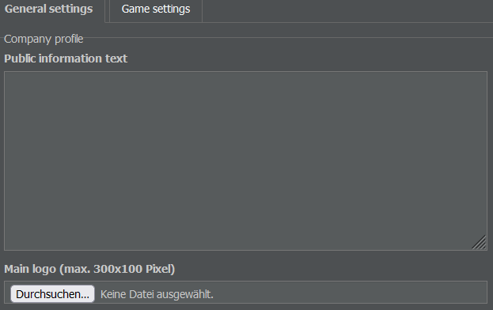
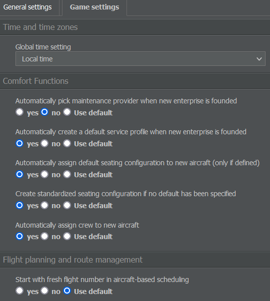
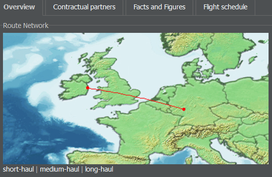

# 公司概况

将鼠标悬停在屏幕左上角的公司名称上，会为您提供有关企业的多个选项。

## 概览

仪表板分为七个部分（也称为小部件）——公司、未来日程、便签、股票、财务评级、形象和子公司——便于快速查看有关您公司的信息。

### 公司

公司面板显示徽标（如果您已上传），以及关于企业的最重要信息，例如名称、代码、总部枢纽、所属国家、航空公司评级、机队规模和员工人数。点击“信息页面”可访问贵公司的企业页面。

### 未来日程

在未来日程面板中，您可以查看基于合同和已终止事件（如飞机交付）的未来三天固定支出和收入。周末结算是财务周期重置并支付员工薪酬的时间。

{}
**信息**  
这些事件不属于航班的直接成本。要查看完整列表，请点击“查看完整财务日程”或在“管理”选项卡中选择“现金流”。
{}

### 记事本

此面板允许您记录有关企业的备注。只要您登录 AirlineSim 就能看到这些备注。要添加或编辑备注，双击它。该备注仅对您可见——其他玩家无法看到。

### 股票

如果一家公司进行首次公开募股（IPO），股票小部件会显示诸如股票报价和股东概况等信息。点击“IPO 信息”会带你到一个显示详细股票数据的页面（也可通过“管理”选项卡中的“公司财务”访问）。

### 财务评级

本节显示你航空公司经济状况的简化版本：现金流表明航空公司赚了多少钱；利润率表示你相对于收入获得的利润金额。所有列出的因素都会合计为总体评级。

### 形象

此面板显示您航空公司在三个舱位（经济舱、商务舱、头等舱）和货运方面的当前形象。绿色条越高，说明顾客越喜欢您的产品。为便于追踪，您可以同时看到当前和上周的形象以及总体趋势。

### 子公司

在此面板中，您会看到所有由您作为主要股东控制的子公司列表。有关股票的更多详细信息，也可在管理选项卡的“子公司与投资组合”页面查看。

## 设置（常规）

如果你点击“概览”选项下方的“设置”，你可以编辑以下内容：

### 公开信息

这是其他用户访问你航空公司概览页面时看到的文本。大多数玩家用它来说明联运规范或公司里程碑。

### 主徽标

在此，您可以为公司上传徽标。该徽标会显示在您的航空公司概览中，仅起装饰作用。文件尺寸必须为 300 x 100 像素。若要删除徽标，只需点击小垃圾桶图标。

### 小徽标

您可以添加一个较小版本的徽标，该徽标将在游戏中各处显示（例如在到达和出发栏上）。该图像尺寸必须为 120 x 23 像素。请确保其也符合我们的徽标指南（可在任一游戏世界的“数据库 > 命名规则”中查看）。

## 设置（游戏）

在“常规设置”旁，你会看到另一个名为“游戏设置”的选项卡。这里可以通过覆盖一些全局设置来个性化 AirlineSim。屏幕右上角的“设置”选项卡中也有一个类似的菜单。

### 时间与时区

在 AirlineSim 中，你可以选择将时间显示为枢纽时间、本地时间或 UTC。该选择会影响游戏内所有显示时间的地方，例如时隙、时刻表和财务日程。

### 舒适功能

舒适功能允许你决定游戏是否应自动处理某些任务。这些可以包括：

* 在新企业成立时选择维护供应商，
* 在新企业成立时创建默认服务配置，
* 为新飞机分配默认座位配置（仅在已定义时），
* 如果未指定默认配置，则创建标准化座位配置
* 以及为新飞机分配机组人员。

由于这些设置会影响游戏体验，建议根据个人喜好进行调整。

### 航班计划与航线管理

在此，您可以指定与航班号、飞机排程、登机方式、货物与行李以及其他一些选项相关的详细信息。

### 通知

此处可让您决定希望从 AirlineSim 接收哪些游戏内通知。

### 系统设置

使用此菜单选择当有人向您发送游戏内消息时是否希望接收电子邮件通知。

### 用户界面

在本节中，您可以通过在“深色”、“明亮”和“经典”主题之间进行选择来调整游戏的视觉效果。您还可以设置与色盲辅助相关的选项以及其他一些界面相关的设置。

## 公司设立与清算

在设置下方，您可以选择创建一个新企业或清算您当前的企业。

{}
**警告**
如果您选择清算，您的企业的所有数据将被不可逆转地删除。所有资产将被出售，建筑物将被拆除，现有的少数股权将归入 AirlineSim，多数股权将导致子企业被删除。股东将按其持股比例收到剩余价值。
{}

请记住，重置仅适用于控股公司（即直接属于您账户的企业）。

## 企业

企业页面提供有关特定公司的信息。你可以通过公司仪表板上的“资讯页面”链接访问，或在搜索栏中输入公司名称。

### 概览

本节显示公司的名称、枢纽和评级等最重要的详细信息，以及其航线网络、机队、子公司、已发布信息、统计数据和新闻。该页面还提供报告功能，若某企业不遵守游戏规则，你可以通过此功能联系支持。

### 合作伙伴

在此标签页中，你会找到有关该航空公司业务关系的信息（例如租赁伙伴）。

### 事实与数据

“数据与统计”选项卡提供了公司统计信息的概览，例如运营航班数量和服务的机场数量。如果您是股东，还可以看到实现的收入等数值。

### 航班时刻表

本页面按出发和到达机场对企业的所有航班进行排序。航班时间可以显示为枢纽时间、本地时间或协调世界时（UTC）。
