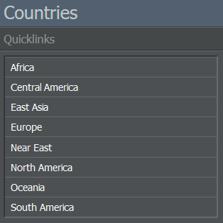
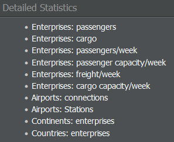
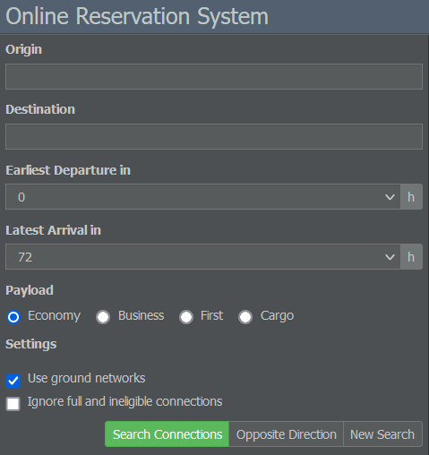

# 数据库选项卡

数据库选项卡让你访问重要的游戏资源，如不同的名录、在线预订系统（ORS）和游戏规则。

## 名录

### 国家

本节列出游戏中所有可用的国家。选择一个国家将进入其信息页面，您可以在其中查看该国签署的条约、对外国投资者的市场准入情况以及其机场信息。

### 企业

在此处，您可以查看注册在您所在游戏世界中的所有企业。点击字母将打开相应公司的列表并显示它们的代码、联盟关联和总部。选择一家航空公司会将您重定向到其企业页面。

### 航空联盟

此菜单允许您筛选游戏世界中现有的联盟。每个列表条目显示联盟的名称、总部和状态。点击某个特定联盟，您可以查看其信息页面，并有选项申请成为成员。

## 其他资源

### 机队列表

使用“机队列表”页面，您可以按国家搜索各自登记的企业及其所属机队。

### 统计数据

在此页面中，您将找到有关游戏世界的一系列统计细节。总体统计包括企业数量或每周航班数等数值。在每周运力菜单中，您可以看到运送的旅客/货物数量清单。详细统计部分包含指向各种排名的链接。

### 在线预订系统

作为游戏的核心功能之一，[在线预订系统（ORS）]()每天生成大量旅行需求并在玩家的航班之间分配乘客。

该界面允许您通过输入出发地/目的地、最早出发/最晚到达时间以及货运类型（经济舱、商务舱、头等舱和货运）来搜索可用航线。

搜索结果会按日期、出发和到达时间、额外经停（如适用）、航班号、价格以及最重要的评分列出。ORS 还会指示航班是否已满或仍可预订。

## 游戏规则

在本部分，您可以查阅游戏的一般规则、命名与标识指南以及被禁止的航线。被禁止的航线指的是在游戏中不允许运营的国家或机场对，通常是由于现实世界中的政治限制或游戏对同城航线的禁止。
