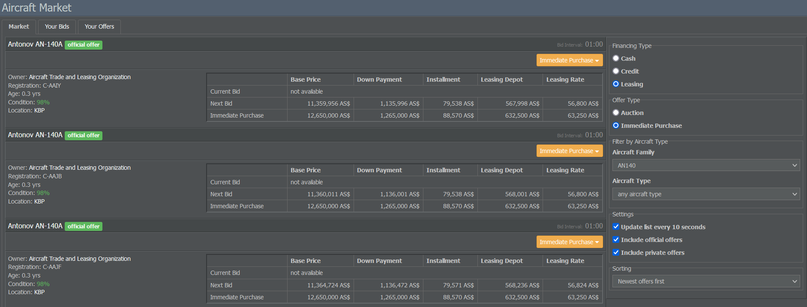
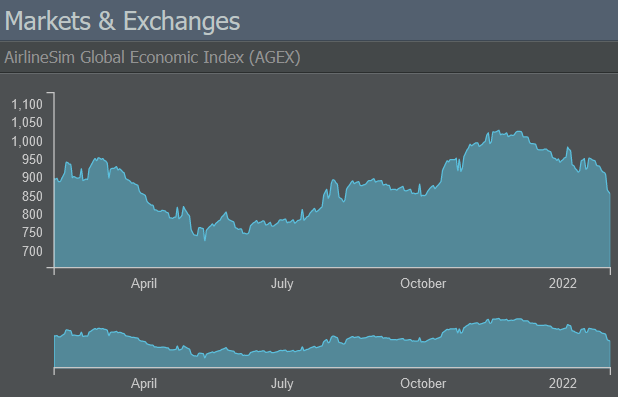
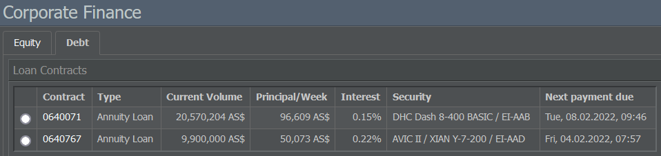
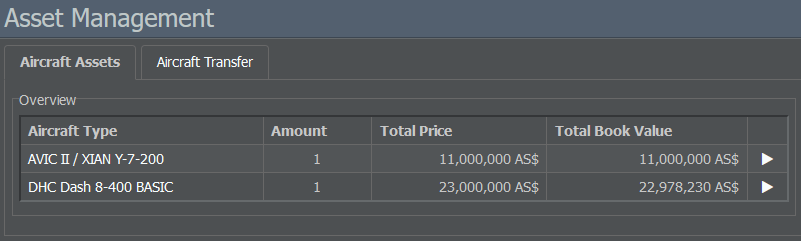

# 管理选项卡

管理选项卡可进入采购、人力资源、投资和财务菜单。

## 采购

### 飞机制造商

在此页面，您可以按制造商和类别（螺旋桨机、支线喷气机、窄体和宽体）查看所有可用的飞机型号。
点击某一飞机型号会显示其相关变体的汇总以及一些一般性信息，例如载客量、速度和航程。

选择其中一个变体会打开飞机说明页，展示该飞机的所有相关数据（厂商建议价、生产时期与产量、航线限制、有效载荷、航程、噪音与维修类别、性能等）。该页面还允许您查看租赁/购买选项并查看二手飞机的报价（如适用）。

### 飞机市场

如果您打算买卖二手飞机，飞机市场是合适的去处。可用飞机可按融资方式（现金、信贷或租赁）、报价类型（拍卖或立即购买）以及飞机系列和型号进行筛选。

每个报价都会提供重要信息，如飞机的所有者、飞机的使用年限和状况以及可用的付款方式。如果你想查看现有的投标和报价概览，请切换到页面顶部的“你的出价”和“你的报价”选项卡。

## 人力资源

### 人员管理

借助此菜单，你可以查看并管理受雇员工。该页面按职务（飞行、客舱和地勤人员）对员工进行分组，并提供有关他们的雇佣状况、情绪和工资明细的洞见。

除飞行员外，所有员工在需要时都会被自动雇用。不过，你可以在“下周薪资”栏的文本框中输入期望金额来调整他们的薪资。请注意：你支付的工资会影响员工的友好度和客户导向性，并最终影响公司形象。

如果需要裁员，请在“多余人员”栏的文本框中输入要裁减的员工人数。

{}
**重要提示**  
解除劳动合同要求你支付相当于若干周默认薪资的遣散费。
{}

### 机组管理

此页面用于管理你的飞行员。在左侧，你可以看到每种机型类别（螺旋桨机、支线喷气机、窄体和宽体客机）当前在职与所需飞行员的列表。绿色数字显示备用飞行员的数量；红色数值表示你仍然需要的飞行员人数。已订购但尚未交付的飞机不包含在此列表中。

飞机类别表示飞行员被允许驾驶的机型类型。如果您想为某一特定型号找到合适的飞行员，请使用右侧菜单雇佣失业飞行员或培养新飞行员。请注意，培训飞行员的费用为其周薪的 5 到 8 倍（取决于飞机类别）。

如果你的飞行员不适合当前机型，可以使用右下角的菜单对他们进行再培训，使其能够驾驶另一种机型。再培训的费用远低于培训新飞行员，因为现有员工通常已有一定的一般飞行经验。

## 投资

### 市场与交易所

“市场与交易所”部分展示了 AirlineSim 全球经济指数（AGEX）和游戏内燃油价格的变化。

页面的其余部分显示了不同的股票交易所和指数。请记住，此页面的内容可能会根据您的游戏世界是否支持[首次公开募股（IPO）]()而有所不同。

### 子公司与投资组合

如果您购买了其他公司的股份，本页面会列出这些股份及一些一般信息，例如评级和账面价值。

### 订单列表

在这里，您可以找到有关股票的买卖订单摘要以及您认购的[首次公开募股（IPO）]()。

## 财务

### 公司财务

此菜单提供有关贵公司股本和债务的信息。股本（Equity）标签显示股东和[首次公开募股]()（如果适用）的详细信息，而债务（Debt）页面则显示现有贷款合同以及新贷款的信息。

### 会计

资产负债表分为三个标签页：损益表、资产负债表和银行账户。

损益表列出公司所有的收入与费用以及最终盈利。为便于更好地了解当前财务状况，损益表将数据结构化为以下会计指标：

* **息税折旧摊销前利润（EBITDA）**：利息、税项、折旧和摊销之前的利润。在 AirlineSim 中，这包括日常运营中的所有费用，而多数是推算性的成本（例如飞行设备的折旧）或纯财务性数字（例如资本成本）则不包括在内。还有一个调整后 EBITDA，排除了不定期的费用。

* **息税前利润（EBIT）**：利息和税前利润。这也被称为经营结果，因为它考虑了运行业务所需设备（如建筑和飞机）的折旧，并在从收入中扣除所有经营成本后让你了解公司业绩如何。

* **税前利润（EBT）**：最后但同样重要的是税前利润。由于 AirlineSim 中（目前）没有税收，这可以被视为最终结果。它与息税前利润（EBIT）的区别在于还加入或扣除了资本成本（例如利息）或资产交易的收益（例如股票交易）。因此，它也被称为财务结果。

资产负债表显示了两张表：在顶部，你会看到一份损益表，分为费用和收入两部分。两者都显示各自的科目（例如飞机处理费或租赁收入）及其相关的余额数值。在下方，你可以看到公司资产（例如建筑或飞行设备）和负债（如股本或贷款）。

银行账户标签列出了你的收入和支出以及它们的日期、时间和金额。

### 现金流

在此页面，您将看到贵公司财务日程的概览，其中显示与合同相关的所有收入和支出，例如

* 租赁付款，
* 私人地面服务费用，
* 贷款偿还，
* 员工工资（周末结算）
* 以及股息（如果有成功的[首次公开募股]()）。

该列表还会显示下一次付款的日期和时间。如果付款会在更下一个周期继续，仅会显示第一次付款。
与航班和维护相关的收入和支出不会包含在此处，因为这类款项会在服务完成后支付，且没有固定的金额或时间。

### 资产管理

资产管理页面分为两部分：飞机资产选项卡显示您已取得的飞机并允许您出售或租赁它们（通过点击机型旁的绿色账本图标），以及飞机转移选项卡允许您将飞机从您当前的企业转移到控股公司的任何其他子公司。

### 租赁

在“租赁”部分，您可以查看所租赁飞机的概览，包括其机龄、出租方、计费日期和租赁费率。您还可以选择取消每一份租赁合同。切换到第二个标签页，可以查看您出借出去的飞机。
