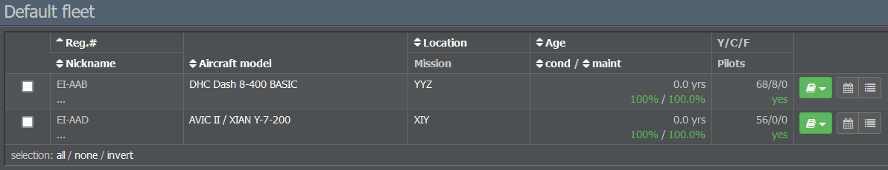
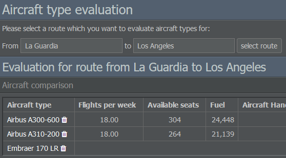

# 运营选项卡

“运营”选项卡分为航班运营和地面运营。

## 航班运营

### 机队管理

机队管理页面显示您已购置的飞机，并允许您通过将它们分配到不同的机队来进行组织。

可以使用右上角的按钮创建新的机队。在左侧，您会看到现有机队的列表以及删除机队的选项。如果删除某个机队，该机队的所有飞机将被转移到标准机队。

选中某一飞机型号旁的复选框时，会弹出“操作”菜单。在此您可以分配客舱配置和机组人员、转移飞机、选择其所属机队，以及激活、锁定或删除其飞行计划。

飞机旁的书本图标可让您查看其合同，或在需要时将其出售或出租。相邻的日历图标会带您到航班计划页面，最右侧的图标显示已排定的航班。

### 飞机类型评估

此工具允许您在所选航线上比较不同飞机以评估其潜在效率。结果列表将显示每周可能的航班次数、可用座位数、燃油消耗、固定成本、每座位成本，以及最重要的——在不同载客率下的预期利润/亏损。您可以在页面右下方调整评估参数，如飞机年龄、服务舱位、座位数和票价。

### 维修保养

在此处，您可以为机队选择维修公司。右侧列表显示所有可用的承包商及其在价格、质量和效率方面的相应表现。请记住，新的维修供应商每两周只能聘用一次，且质量与效率会影响您的飞机维修比率。

### 运营控制

“运营控制”页面显示按飞机型号分类的已运营航班时间线。您可以通过在左侧字段中输入所需数值来选择机队和时间跨度。

## 地面运营

### 航站

本页面概述了你航空公司的航站，允许你按国家筛选，并显示有关机场噪音和夜间限制以及客运与货运需求、能力和处理量的详细信息。

在列表中的每个航站，你还会找到指向你的载客/货统计和航班时刻表以及该航站信息页面的链接。右侧的菜单可让你开设新航站。

在页面标题下方的文本框中，您可以快速查找特定航站。只需输入其名称或代码，系统就会将您重定向到该航站的资讯页面。

### 设施

“设施”页面显示您航空公司的建筑和服务合约。
