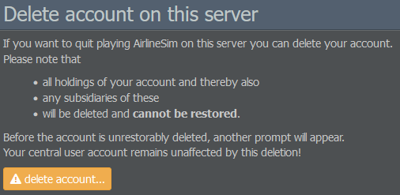

# 设置

## 账户设置

### 您的个人资料

“您的个人资料”部分提供诸如账户用户名和状态（试用期 / 高级）等信息。在右侧，您会看到在游戏世界中的持股公司和子公司的列表。

### 您的持股公司

此页面显示您的每日点数消耗以及当前余额。右侧还会显示您当前的活跃持股公司列表。

### 设置 / 游戏世界

点击 设置 / 游戏世界 会带您返回仪表板，该仪表板也会在通过 [AirlineSim 网站](https://www.airlinesim.aero/en/) 登录后出现。在这里，您可以查看可用的游戏世界、购买点数并调整账户设置，如您的电子邮箱地址、密码和通知。

## 游戏世界设置

### 设置

这里显示的设置与游戏设置中可用的选项非常相似。然而，此菜单还允许你选择界面语言以及电子邮件通知的语言。此外，你还可以选择是否向他人公开你的在线状态。

### 停用

此选项允许您将账户从游戏世界中删除。

{}
**警告**  
这将不可逆地删除您账户的所有持有资产和子公司，因此在继续之前请仔细阅读页面上提供的详细信息。您的中央用户账户不受此影响。
{}
